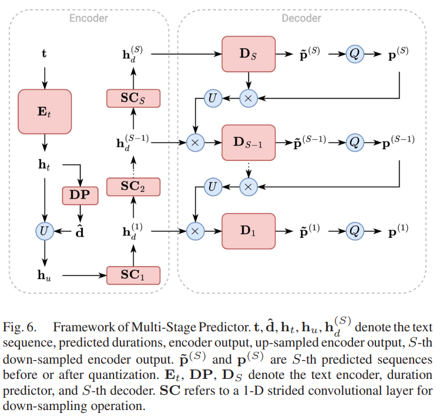

# PaperSummary
___
## Tacotron: Towards End-to-End Speech Synthesis
原文：https://arxiv.org/abs/1703.10135  
翻译：https://blog.csdn.net/weixin_42721167/article/details/113406997  
代码：https://github.com/linslime/tacotron  
### Tacotron  
#### Tacotron模型结构：  
  
#### CBHG模型结构：  
  
___
## Natural TTS Synthesis by Conditioning WaveNet on Mel Spectrogram Predictions
原文：https://arxiv.org/abs/1712.05884  
翻译：https://blog.csdn.net/weixin_43916891/article/details/127463829  
     https://blog.csdn.net/weixin_42721167/article/details/114377171  
代码：https://github.com/linslime/Tacotron2-PyTorch  
### Tacotron2
#### Tacotron模型结构
  
   

___
## FastSpeech: Fast, Robust and Controllable Text to Speech
原文：https://arxiv.org/abs/1905.09263  
翻译：https://blog.csdn.net/weixin_42721167/article/details/118226439  
代码：https://github.com/linslime/FastSpeech  
### FastSpeech
#### FastSpeech模型结构

___
## FastSpeech 2: Fast and High-Quality End-to-End Text to Speech
原文：https://arxiv.org/abs/2006.04558  
翻译：https://blog.csdn.net/weixin_42721167/article/details/118226439  
代码：https://github.com/linslime/FastSpeech2
### FastSpeech2
#### FastSpeech模型结构

___
## Neural Speech Synthesis with Transformer Network
原文：https://arxiv.org/abs/1809.08895  
翻译：https://blog.csdn.net/weixin_42721167/article/details/119639442  
代码：https://github.com/linslime/Transformer-TTS  
### Transformer-TTS
#### Transformer-TTS模型结构

___
## WaveGlow: A Flow-based Generative Network for Speech Synthesis
原文：https://arxiv.org/abs/1811.00002  
翻译：https://blog.csdn.net/weixin_42721167/article/details/115493648  
代码：https://github.com/NVIDIA/waveglow
### WaveGlow
#### WaveGlow模型结构

___
## Deep Voice 3: Scaling Text-to-Speech with Convolutional Sequence Learning
原文：https://arxiv.org/abs/1710.07654  
翻译：https://blog.csdn.net/weixin_42721167/article/details/114479658
### DEEP VOICE 3
#### DEEP VOICE 3模型结构

#### Convolution Block

#### Attention Block

#### WORLD Block

___
## Voice Transformer Network: Sequence-to-Sequence Voice Conversion Using Transformer with Text-to-Speech Pretraining
原文：https://arxiv.org/abs/1912.06813  
翻译：https://blog.csdn.net/weixin_42721167/article/details/114759156
### Voice Transformer Network
#### Voice Transformer Network模型结构

#### 训练过程

___
## WaveNet: A Generative Model for Raw Audio
原文：https://arxiv.org/abs/1609.03499  
翻译：https://blog.csdn.net/weixin_42721167/article/details/112593690  
代码：https://github.com/linslime/WaveNet
### WaveNet
#### WaveNet模型结构

#### 因果卷积

#### 扩大卷积

___
## HiFi-GAN: Generative Adversarial Networks for Efficient and High Fidelity Speech Synthesis
原文：https://arxiv.org/abs/2010.05646  
翻译:https://blog.csdn.net/weixin_42262721/article/details/120796935  
代码：https://github.com/linslime/hifi-gan
### HHiFi-GAN
#### Generator

#### Discriminator

___
## Pixel Recurrent Neural Networks
原文：https://arxiv.org/abs/1601.06759  
翻译：https://blog.csdn.net/Blackoutdragon/article/details/131163328  
代码：https://github.com/linslime/PixelCNN
___
## Conditional Variational Autoencoder with Adversarial Learning for End-to-End Text-to-Speech
原文：https://arxiv.org/abs/2106.06103  
翻译：https://blog.csdn.net/zzfive/article/details/127061469  
代码：https://github.com/linslime/vits
### VITS
#### VITS模型训练和推演过程

#### 框图描述了随机持续时间预测器的 (a) 训练过程和 (b) 推理过程。随机持续时间预测器的主要构建块是 (c) 膨胀和深度可分离的卷积残差块

#### (a) 条件编码器和 (b) 随机持续时间预测器中使用的耦合层的架构

___
## NaturalSpeech: End-to-End Text to Speech Synthesis with Human-Level Quality
原文：https://arxiv.org/abs/2205.04421  
翻译：https://blog.csdn.net/weixin_44649780/article/details/134829743  
代码：https://github.com/heatz123/naturalspeech
### NaturalSpeech
#### NaturalSpeech模型训练和推演过程

___
## NaturalSpeech 2: Latent Diffusion Models are Natural and Zero-Shot Speech and Singing Synthesizers
原文：https://arxiv.org/abs/2304.09116  
翻译：https://blog.csdn.net/weixin_44649780/article/details/134828929  
代码：https://github.com/lucidrains/naturalspeech2-pytorch
### NaturalSpeech 2
#### NaturalSpeech 2模型结构

___
## VoiceCraft: Zero-Shot Speech Editing and Text-to-Speech in the Wild
原文：https://arxiv.org/abs/2403.16973  
翻译：https://blog.csdn.net/matt45m/article/details/140153776  
代码：https://github.com/jasonppy/voicecraft  
### VoiceCraft
#### VoiceCraft模型结构

___
## VITS2: Improving Quality and Efficiency of Single-Stage Text-to-Speech with Adversarial Learning and Architecture Design
原文：https://arxiv.org/abs/2307.16430  
翻译：https://blog.csdn.net/qq_39247879/article/details/132168384
### VITS2
#### VITS2模型结构

___
## PITS: Variational Pitch Inference without Fundamental Frequency for End-to-End Pitch-controllable TTS
原文：https://arxiv.org/abs/2302.12391  
代码：https://github.com/anonymous-pits/pits
### PITS
#### PITS模型结构

___
## MSMC-TTS: Multi-Stage Multi-Codebook VQ-VAE Based Neural TTS
原文：https://ieeexplore.ieee.org/abstract/document/10114504
### MSMC-TTS
#### Framework of the neural TTS system

#### Framework of VQ-VAE for speech data

#### Multi-Head Vector Quantization

#### Architecture of the multi-stage multi-codebook VQ-VAE

#### Framework of MSMC-TTS.

#### Multi-Stage Predictor.

___
## StyleTTS 2: Towards Human-Level Text-to-Speech through Style Diffusion and Adversarial Training with Large Speech Language Models
原文：https://proceedings.neurips.cc/paper_files/paper/2023/hash/3eaad2a0b62b5ed7a2e66c2188bb1449-Abstract-Conference.html  
译文：https://zhuanlan.zhihu.com/p/681000850
### StyleTTS 2
#### Acoustic modules pre-training and joint training.

#### SLM adversarial training and inference.

___
## P-Flow: A Fast and Data-Efficient Zero-Shot TTS through Speech Prompting
原文：https://proceedings.neurips.cc/paper_files/paper/2023/hash/eb0965da1d2cb3fbbbb8dbbad5fa0bfc-Abstract-Conference.html
### P-Flow
#### The overall diagram of P-Flow.

#### Flow Matching Decoder

___
## AdvTTS: Adversarial Text-to-Speech Synthesis Attack on Speaker Identification Systems
原文：https://ieeexplore.ieee.org/document/10447190  
### ABSTRACT
说话人识别 (SI) 系统已广泛应用于实际应用中。然而，最近的研究表明，即使不向攻击者提供反馈，SI 系统也容易受到两种普遍存在的攻击：基于转移的对抗攻击和语音合成欺骗攻击。基于转移的对抗攻击面临着收集特定内容和音色的自然语音的挑战。相比之下，语音合成欺骗攻击可以合成任何内容和音色的语音，但可以被音频深度伪造检测器 (ADD) 检测到。在本文中，我们提出了一种称为对抗性文本到语音合成 (AdvTTS) 的新方法来攻击 SI 系统。AdvTTS 结合了基于转移的对抗攻击和语音合成欺骗攻击的优势，通过使用本地代理模型合成可转移的攻击语音。 AdvTTS 是首个能够对任意语音内容和音色进行对抗和欺骗攻击的攻击方法。AdvTTS 能够以高质量语音欺骗 SI 系统，同时逃避 ADD 检测。实验表明，AdvTTS 在欺骗攻击方面的表现优于其他基线，并且在与投影梯度下降 (PGD) 相结合的对抗攻击方面的表现优于基线。
>Speaker identification (SI) systems have been widely em
ployed in real-world applications. However, recent research
 has demonstrated that SI systems are vulnerable to two preva
lent attacks even without providing feedback to the attacker:
 the transfer-based adversarial attack and the speech synthe
sis spoofing attack. The transfer-based adversarial attack
 faces the challenges of collecting natural speech for specific
 content and timbre. In contrast, the speech synthesis spoof
ing attack can synthesize speech for any content and timbre
 but can be detected by audio deepfake detectors (ADD). In
 this paper, we propose a novel method, called adversarial
 text-to-speech synthesis (AdvTTS), for attacking SI systems.
 AdvTTS combines the strengths of transfer-based adversarial
 attacks and speech synthesis spoofing attacks, by synthesiz
ing transferable attack speech with local surrogate models.
 AdvTTS is the first attack method that can conduct both ad
versarial and spoofing attacks with any speech content and
 timbre. AdvTTS can deceive SI systems with high-quality
 speech while evading ADD detection. Experiments show that
 AdvTTS can outperform other baselines for spoofing attacks,
 and can outperform the baselines for adversarial attacks with
 the combination of projected gradient descent (PGD).
### AdvTTS
#### The architecture of AdvTTS
