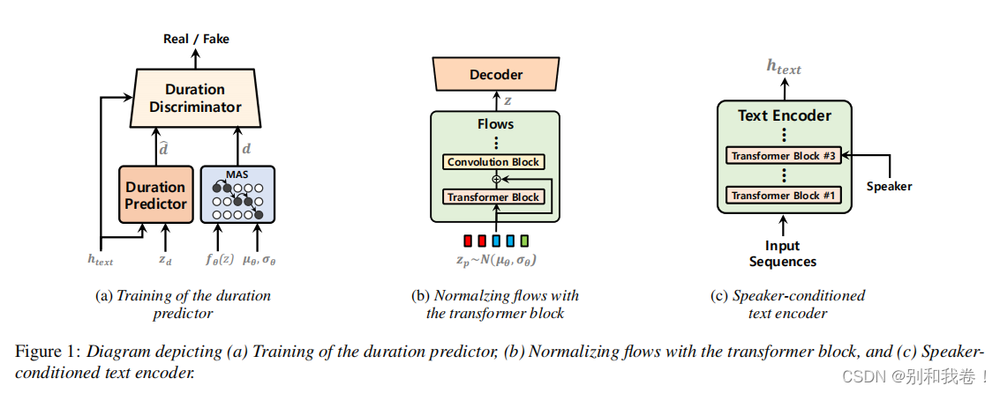

# PaperSummary
___
## Tacotron: Towards End-to-End Speech Synthesis
原文：https://arxiv.org/abs/1703.10135  
翻译：https://blog.csdn.net/weixin_42721167/article/details/113406997  
代码：https://github.com/linslime/tacotron  
### Tacotron  
#### Tacotron模型结构：  
  
#### CBHG模型结构：  
  
___
## Natural TTS Synthesis by Conditioning WaveNet on Mel Spectrogram Predictions
原文：https://arxiv.org/abs/1712.05884  
翻译：https://blog.csdn.net/weixin_43916891/article/details/127463829  
     https://blog.csdn.net/weixin_42721167/article/details/114377171  
代码：https://github.com/linslime/Tacotron2-PyTorch  
### Tacotron2
#### Tacotron模型结构
  
   

___
## FastSpeech: Fast, Robust and Controllable Text to Speech
原文：https://arxiv.org/abs/1905.09263  
翻译：https://blog.csdn.net/weixin_42721167/article/details/118226439  
代码：https://github.com/linslime/FastSpeech  
### FastSpeech
#### FastSpeech模型结构

___
## FastSpeech 2: Fast and High-Quality End-to-End Text to Speech
原文：https://arxiv.org/abs/2006.04558  
翻译：https://blog.csdn.net/weixin_42721167/article/details/118226439  
代码：https://github.com/linslime/FastSpeech2
### FastSpeech2
#### FastSpeech模型结构

___
## Neural Speech Synthesis with Transformer Network
原文：https://arxiv.org/abs/1809.08895  
翻译：https://blog.csdn.net/weixin_42721167/article/details/119639442  
代码：https://github.com/linslime/Transformer-TTS  
### Transformer-TTS
#### Transformer-TTS模型结构

___
## WaveGlow: A Flow-based Generative Network for Speech Synthesis
原文：https://arxiv.org/abs/1811.00002  
翻译：https://blog.csdn.net/weixin_42721167/article/details/115493648  
代码：https://github.com/NVIDIA/waveglow
### WaveGlow
#### WaveGlow模型结构

___
## Deep Voice 3: Scaling Text-to-Speech with Convolutional Sequence Learning
原文：https://arxiv.org/abs/1710.07654  
翻译：https://blog.csdn.net/weixin_42721167/article/details/114479658
### DEEP VOICE 3
#### DEEP VOICE 3模型结构

#### Convolution Block

#### Attention Block

#### WORLD Block

___
## Voice Transformer Network: Sequence-to-Sequence Voice Conversion Using Transformer with Text-to-Speech Pretraining
原文：https://arxiv.org/abs/1912.06813  
翻译：https://blog.csdn.net/weixin_42721167/article/details/114759156
### Voice Transformer Network
#### Voice Transformer Network模型结构

#### 训练过程

___
## WaveNet: A Generative Model for Raw Audio
原文：https://arxiv.org/abs/1609.03499  
翻译：https://blog.csdn.net/weixin_42721167/article/details/112593690  
代码：https://github.com/linslime/WaveNet
### WaveNet
#### WaveNet模型结构

#### 因果卷积

#### 扩大卷积

___
## HiFi-GAN: Generative Adversarial Networks for Efficient and High Fidelity Speech Synthesis
原文：https://arxiv.org/abs/2010.05646  
翻译:https://blog.csdn.net/weixin_42262721/article/details/120796935  
代码：https://github.com/linslime/hifi-gan
### HHiFi-GAN
#### Generator

#### Discriminator

___
## Pixel Recurrent Neural Networks
原文：https://arxiv.org/abs/1601.06759  
翻译：https://blog.csdn.net/Blackoutdragon/article/details/131163328  
代码：https://github.com/linslime/PixelCNN
___
## Conditional Variational Autoencoder with Adversarial Learning for End-to-End Text-to-Speech
原文：https://arxiv.org/abs/2106.06103  
翻译：https://blog.csdn.net/zzfive/article/details/127061469  
代码：https://github.com/linslime/vits
### VITS
#### VITS模型训练和推演过程

#### 框图描述了随机持续时间预测器的 (a) 训练过程和 (b) 推理过程。随机持续时间预测器的主要构建块是 (c) 膨胀和深度可分离的卷积残差块

#### (a) 条件编码器和 (b) 随机持续时间预测器中使用的耦合层的架构

___
## NaturalSpeech: End-to-End Text to Speech Synthesis with Human-Level Quality
原文：https://arxiv.org/abs/2205.04421  
翻译：https://blog.csdn.net/weixin_44649780/article/details/134829743  
代码：https://github.com/heatz123/naturalspeech
### NaturalSpeech
#### NaturalSpeech模型训练和推演过程

___
## NaturalSpeech 2: Latent Diffusion Models are Natural and Zero-Shot Speech and Singing Synthesizers
原文：https://arxiv.org/abs/2304.09116  
翻译：https://blog.csdn.net/weixin_44649780/article/details/134828929  
代码：https://github.com/lucidrains/naturalspeech2-pytorch
### NaturalSpeech 2
#### NaturalSpeech 2模型结构

___
## VoiceCraft: Zero-Shot Speech Editing and Text-to-Speech in the Wild
原文：https://arxiv.org/abs/2403.16973  
翻译：https://blog.csdn.net/matt45m/article/details/140153776  
代码：https://github.com/jasonppy/voicecraft  
### VoiceCraft
#### VoiceCraft模型结构

___
## VITS2: Improving Quality and Efficiency of Single-Stage Text-to-Speech with Adversarial Learning and Architecture Design
原文：https://arxiv.org/abs/2307.16430  
翻译：https://blog.csdn.net/qq_39247879/article/details/132168384
### VITS2
#### VITS2模型结构

___
## PITS: Variational Pitch Inference without Fundamental Frequency for End-to-End Pitch-controllable TTS
原文：https://arxiv.org/abs/2302.12391  
代码：https://github.com/anonymous-pits/pits
### PITS
#### PITS模型结构

___
## MSMC-TTS: Multi-Stage Multi-Codebook VQ-VAE Based Neural TTS
原文：https://ieeexplore.ieee.org/abstract/document/10114504
### MSMC-TTS
#### Framework of the neural TTS system

#### Framework of VQ-VAE for speech data

#### Multi-Head Vector Quantization

#### Architecture of the multi-stage multi-codebook VQ-VAE

#### Framework of MSMC-TTS.

#### Multi-Stage Predictor.

___
## StyleTTS 2: Towards Human-Level Text-to-Speech through Style Diffusion and Adversarial Training with Large Speech Language Models
原文：https://proceedings.neurips.cc/paper_files/paper/2023/hash/3eaad2a0b62b5ed7a2e66c2188bb1449-Abstract-Conference.html  
译文：https://zhuanlan.zhihu.com/p/681000850
### StyleTTS 2
#### Acoustic modules pre-training and joint training.

#### SLM adversarial training and inference.

___
## P-Flow: A Fast and Data-Efficient Zero-Shot TTS through Speech Prompting
原文：https://proceedings.neurips.cc/paper_files/paper/2023/hash/eb0965da1d2cb3fbbbb8dbbad5fa0bfc-Abstract-Conference.html
### P-Flow
#### The overall diagram of P-Flow.

#### Flow Matching Decoder

___
## AdvTTS: Adversarial Text-to-Speech Synthesis Attack on Speaker Identification Systems
原文：https://ieeexplore.ieee.org/document/10447190  
### ABSTRACT
说话人识别 (SI) 系统已广泛应用于实际应用中。然而，最近的研究表明，即使不向攻击者提供反馈，SI 系统也容易受到两种普遍存在的攻击：基于转移的对抗攻击和语音合成欺骗攻击。基于转移的对抗攻击面临着收集特定内容和音色的自然语音的挑战。相比之下，语音合成欺骗攻击可以合成任何内容和音色的语音，但可以被音频深度伪造检测器 (ADD) 检测到。在本文中，我们提出了一种称为对抗性文本到语音合成 (AdvTTS) 的新方法来攻击 SI 系统。AdvTTS 结合了基于转移的对抗攻击和语音合成欺骗攻击的优势，通过使用本地代理模型合成可转移的攻击语音。 AdvTTS 是首个能够对任意语音内容和音色进行对抗和欺骗攻击的攻击方法。AdvTTS 能够以高质量语音欺骗 SI 系统，同时逃避 ADD 检测。实验表明，AdvTTS 在欺骗攻击方面的表现优于其他基线，并且在与投影梯度下降 (PGD) 相结合的对抗攻击方面的表现优于基线。
>Speaker identification (SI) systems have been widely em
ployed in real-world applications. However, recent research
 has demonstrated that SI systems are vulnerable to two preva
lent attacks even without providing feedback to the attacker:
 the transfer-based adversarial attack and the speech synthe
sis spoofing attack. The transfer-based adversarial attack
 faces the challenges of collecting natural speech for specific
 content and timbre. In contrast, the speech synthesis spoof
ing attack can synthesize speech for any content and timbre
 but can be detected by audio deepfake detectors (ADD). In
 this paper, we propose a novel method, called adversarial
 text-to-speech synthesis (AdvTTS), for attacking SI systems.
 AdvTTS combines the strengths of transfer-based adversarial
 attacks and speech synthesis spoofing attacks, by synthesiz
ing transferable attack speech with local surrogate models.
 AdvTTS is the first attack method that can conduct both ad
versarial and spoofing attacks with any speech content and
 timbre. AdvTTS can deceive SI systems with high-quality
 speech while evading ADD detection. Experiments show that
 AdvTTS can outperform other baselines for spoofing attacks,
 and can outperform the baselines for adversarial attacks with
 the combination of projected gradient descent (PGD).
### AdvTTS
#### The architecture of AdvTTS

___
## Towards Universal Speech Discrete Tokens: A Case Study for ASR and TTS
原文：https://ieeexplore.ieee.org/document/10447751  
代码：https://github.com/k2-fsa/icefall 
### ABSTRACT
自监督学习 (SSL) 在语音相关任务中的熟练程度推动了将离散标记用于语音任务（如识别和翻译）的研究，这些任务具有较低的存储要求和采用自然语言处理技术的巨大潜力。然而，这些研究主要集中于单任务，面临着语音识别任务中过度拟合和性能下降等挑战，通常以牺牲多任务场景中的性能为代价。本研究对语音识别和合成任务中各种领先的 SSL 模型生成的离散标记进行了全面的比较和优化。我们的目标是探索语音离散标记在多个语音任务中的通用性。实验结果表明，离散标记在语音识别任务中与在 FBank 特征上训练的系统取得了相当的结果，并且在主观和客观指标上优于语音合成中的梅尔频谱图特征。这些发现表明通用离散标记在各种语音相关任务中具有巨大的潜力。我们的工作是开源的
，可在 https://github.com/k2-fsa/icefall 上公开获取。
> Self-supervised learning (SSL) proficiency in speech-related tasks
 has driven research into utilizing discrete tokens for speech tasks like
 recognition and translation, which offer lower storage requirements
 and great potential to employ natural language processing tech
niques. However, these studies, mainly single-task focused, faced
 challenges like overfitting and performance degradation in speech
 recognition tasks, often at the cost of sacrificing performance in
 multi-task scenarios. This study presents a comprehensive compari
son and optimization of discrete tokens generated by various leading
 SSL models in speech recognition and synthesis tasks. We aim to
 explore the universality of speech discrete tokens across multiple
 speech tasks. Experimental results demonstrate that discrete tokens
 achieve comparable results against systems trained on FBank fea
tures in speech recognition tasks and outperform mel-spectrogram
 features in speech synthesis in subjective and objective metrics.
 These findings suggest that universal discrete tokens have enormous
 potential in various speech-related tasks. Our work is open-source
 and publicly available at https://github.com/k2-fsa/icefall.
### speech discrete tokens

___
## REFLOW-TTS:A RECTIFIED FLOW MODEL FOR HIGH-FIDELITY TEXT-TO-SPEECH
原文：https://ieeexplore.ieee.org/document/10447822
### ABSTRACT
包括去噪扩散概率模型 (DDPM) 和基于分数的生成模型在内的扩散模型在语音合成任务中表现出色。然而，它的有效性是以大量的采样步骤为代价的，导致合成高质量语音所需的采样时间延长。这个缺点阻碍了它在现实世界场景中的实际适用性。在本文中，我们介绍了一种新的基于整流流的高保真语音合成方法 ReFlow-TTS。具体来说，我们的 ReFlow-TTS 只是一个常微分方程 (ODE) 模型，它尽可能通过直线路径将高斯分布传输到地面真实梅尔频谱图分布。此外，我们提出的方法能够通过单个采样步骤实现高质量的语音合成，并且无需训练教师模型。我们在 LJSpeech 数据集上的实验表明，与其他基于扩散的模型相比，我们的 ReFlow-TTS 方法实现了最佳性能。与现有的单步 TTS 模型相比，采用单步采样的 ReFlow-TTS 取得了具有竞争力的性能。
> The diffusion models including Denoising Diffusion Probabilistic
 Models (DDPM) and score-based generative models have demon
strated excellent performance in speech synthesis tasks. However, its
 effectiveness comes at the cost of numerous sampling steps, result
ing in prolonged sampling time required to synthesize high-quality
 speech. This drawback hinders its practical applicability in real
world scenarios. In this paper, we introduce ReFlow-TTS, a novel
 rectified flow based method for speech synthesis with high-fidelity.
 Specifically, our ReFlow-TTS is simply an Ordinary Differential
 Equation (ODE) model that transports Gaussian distribution to the
 ground-truth Mel-spectrogram distribution by straight line paths as
 much as possible. Furthermore, our proposed approach enables
 high-quality speech synthesis with a single sampling step and elim
inates the need for training a teacher model. Our experiments on
 LJSpeech Dataset show that our ReFlow-TTS method achieves
 the best performance compared with other diffusion based models.
 And the ReFlow-TTS with one step sampling achieves competitive
 performance compared with existing one-step TTS models.
### REFLOW-TTS
#### An illustration of ReFlow-TTS.

___
## Multi-Task Learning for Front-End Text Processing in TTS
原文：https://ieeexplore.ieee.org/document/10446241
### ABSTRACT
我们提出了一个多任务学习 (MTL) 模型，用于联合执行通常在文本转语音 (TTS) 前端解决的三个任务：文本规范化 (TN)、词性 (POS) 标记和同形异义词消歧 (HD)。我们的框架采用树状结构，其主干学习共享表示，然后是单独的特定于任务的头。我们进一步结合了预先训练的语言模型来利用其内置的词汇和上下文知识，并研究如何最好地使用其嵌入，以最有效地使我们的多任务模型受益。通过任务消融，我们表明，与在单个或子任务组合上训练的模型相比，我们在所有三个任务上训练的完整模型实现了最强的整体性能，证实了我们的 MTL 框架的优势。最后，我们引入了一个新的 HD 数据集，其中包含不同上下文中各种同形异义词及其发音的平衡数量的句子。我们证明，与仅使用常用但不平衡的预先存在的数据集相比，将该数据集纳入训练可以显著提高 HD 性能。
> Wepropose a multi-task learning (MTL) model for jointly performing
 three tasks that are commonly solved in a text-to-speech (TTS) front
end: text normalization (TN), part-of-speech (POS) tagging, and
 homograph disambiguation (HD). Our framework utilizes a tree-like
 structure with a trunk that learns shared representations, followed by
 separate task-specific heads. We further incorporate a pre-trained lan
guage model to utilize its built-in lexical and contextual knowledge,
 and study how to best use its embeddings so as to most effectively
 benefit our multi-task model. Through task-wise ablations, we show
 that our full model trained on all three tasks achieves the strongest
 overall performance compared to models trained on individual or
 sub-combinations of tasks, confirming the advantages of our MTL
 framework. Finally, we introduce a new HD dataset containing a bal
anced number of sentences in diverse contexts for a variety of homo
graphs and their pronunciations. We demonstrate that incorporating
 this dataset into training significantly improves HD performance over
 only using a commonly used, but imbalanced, pre-existing dataset.
### Multi-Task

___
## Leveraging Speech PTM, Text LLM, And Emotional TTS For Speech Emotion Recognition
原文：https://ieeexplore.ieee.org/document/10445906
### ABSTRACT
在本文中，我们探索了如何使用最先进的语音预训练模型 (PTM)、data2vec、文本生成技术 GPT-4 和语音合成技术 Azure TTS 来增强语音情感识别 (SER)。首先，我们研究了不同语音自监督预训练模型的表示能力，发现 data2vec 在 SER 任务上具有良好的表示能力。其次，我们采用了强大的大型语言模型 (LLM)、GPT-4 和情感文本转语音 (TTS) 模型 Azure TTS 来生成情感一致的文本和语音。我们精心设计了文本提示和数据集构建，以获得高质量的合成情感语音数据。第三，我们研究了不同的数据增强方法，以使用合成语音来促进 SER 任务，包括随机混合、对抗训练、迁移学习和课程学习。在 IEMOCAP 数据集上进行的实验和消融研究证明了我们的方法与其他数据增强方法以及使用其他合成数据进行数据增强相比的有效性。
> In this paper, we explored how to boost speech emotion recogni
tion (SER) with the state-of-the-art speech pre-trained model (PTM),
 data2vec, text generation technique, GPT-4, and speech synthesis
 technique, Azure TTS. First, we investigated the representation abil
ity of different speech self-supervised pre-trained models, and we
 found that data2vec has a good representation ability on the SER
 task. Second, we employed apowerful large language model (LLM),
 GPT-4, and emotional text-to-speech (TTS) model, Azure TTS, to
 generate emotionally congruent text and speech. We carefully de
signed the text prompt and dataset construction, to obtain the syn
thetic emotional speech data with high quality. Third, we stud
ied different ways of data augmentation to promote the SER task
 with synthetic speech, including random mixing, adversarial train
ing, transfer learning, and curriculum learning. Experiments and
 ablation studies on the IEMOCAP dataset demonstrate the effective
ness of our method, compared with other data augmentation meth
ods, and data augmentation with other synthetic data.
___
## DCTTS: Discrete Diffusion Model with Contrastive Learning for Text-to-Speech Generation
原文：https://ieeexplore.ieee.org/document/10447661  
### ABSTRACT
在文本转语音（TTS）任务中，潜在扩散模型具有出色的保真度和泛化能力，但其昂贵的资源消耗和较慢的推理速度一直是一个挑战。为了解决这个问题，本文提出了一种用于文本转语音生成（DCTTS）的具有对比学习的离散扩散模型。具体来说，我们采用一个简单有效的文本编码器，使用 VQ 模型将原始数据压缩到离散空间，然后在离散空间上训练扩散模型。为了最大限度地减少合成高质量语音所需的扩散步骤数，我们在整个扩散模型训练阶段使用了对比学习损失。实验结果表明，本文提出的方法具有出色的语音合成质量和采样速度，同时显着降低了扩散模型的资源消耗。合成样本可在 https://github.com/lawtherWu/DCTTS 获得
> In the Text-to-speech(TTS) task, the latent diffusion model
 has excellent fidelity and generalization, but its expensive
 resource consumption and slow inference speed have always
 been a challenging. To address this issue, this paper pro
poses the Discrete Diffusion Model with Contrastive Learn
ing for Text-to-Speech Generation(DCTTS). Specifically, we
 employs a straightforward and effective text encoder, com
presses the raw data into discrete space using VQ model, and
 then trains the diffusion model on the discrete space. In order
 to minimize the number of diffusion steps needed to synthe
sis high-quality speech, we used a contrastive learning loss
 throughout the diffusion model training phase.The experi
mental results demonstrate that the approach proposed in this
 paper has outstanding speech synthesis quality and sampling
 speed while significantly reducing the resource consumption
 of diffusion model. The synthesized samples are available at
 https://github.com/lawtherWu/DCTTS
### DCTTS

___
## Matcha-TTS: A Fast TTS Architecture with Conditional Flow Matching
原文：https://ieeexplore.ieee.org/document/10448291
### ABSTRACT
我们引入了 Matcha-TTS，这是一种用于快速 TTS 声学建模的新型编码器-解码器架构，使用最优传输条件流匹配 (OT-CFM) 进行训练。与使用分数匹配训练的模型相比，这产生了一个基于 ODE 的解码器，能够在更少的合成步骤中实现高输出质量。精心的设计选择还确保每个合成步骤运行速度快。该方法是概率性的、非自回归的，并且无需外部对齐即可从头开始学习说话。与强大的预训练基线模型相比，Matcha-TTS 系统占用的内存最小，在长话语上可与最快的模型相媲美，并在听力测试中获得最高的平均意见分数。
> We introduce Matcha-TTS, a new encoder-decoder architecture for
 speedy TTS acoustic modelling, trained using optimal-transport
 conditional flow matching (OT-CFM). This yields an ODE-based
 decoder capable of high output quality in fewer synthesis steps than
 models trained using score matching. Careful design choices ad
ditionally ensure each synthesis step is fast to run. The method
 is probabilistic, non-autoregressive, and learns to speak from
 scratch without external alignments. Compared to strong pre-trained
 baseline models, the Matcha-TTS system has the smallest memory
 footprint, rivals the speed of the fastest model on long utterances,
 and attains the highest mean opinion score in a listening test.
### Matcha-TTS
#### Matcha-TTS模型

#### Matcha-TTS decoder

___
## StoryTTS: A Highly Expressive Text-to-Speech Dataset with Rich Textual Expressiveness Annotations
原文：https://ieeexplore.ieee.org/document/10446023
### ABSTRACT
虽然声学表现力在表达性文本转语音 (ETTS) 中早已得到研究，但文本的固有表现力却缺乏足够的关注，尤其是对于艺术作品的 ETTS。在本文中，我们介绍了 StoryTTS，这是一个高度 ETTS 数据集，包含丰富的声学和文本表现力，来自普通话讲故事节目的录音。提出了一个系统而全面的文本表现力标记框架。我们通过语言学、修辞学等分析和定义 StoryTTS 中与语音相关的文本表现力，包括五个不同的维度。然后我们使用大型语言模型，并用一些手动注释示例提示它们进行批量注释。由此产生的语料库包含 61 小时的连续和高度韵律的语音，配备了准确的文本转录和丰富的文本表现力注释。因此，StoryTTS 可以帮助未来的 ETTS 研究充分挖掘丰富的内在文本和声学特征。实验验证了 TTS 模型与 StoryTTS 中的带注释的文本标签结合后能够生成表现力更强的语音。
> While acoustic expressiveness has long been studied in expressive
 text-to-speech (ETTS), the inherent expressiveness in text lacks suf
f
 icient attention, especially for ETTS of artistic works. In this pa
per, we introduce StoryTTS, a highly ETTS dataset that contains
 rich expressiveness both in acoustic and textual perspective, from the
 recording of a Mandarin storytelling show. A systematic and com
prehensive labeling framework is proposed for textual expressive
ness. We analyze and define speech-related textual expressiveness
 in StoryTTS to include five distinct dimensions through linguistics,
 rhetoric, etc. Then we employ large language models and prompt
 them with a few manual annotation examples for batch annotation.
 The resulting corpus contains 61 hours of consecutive and highly
 prosodic speech equipped with accurate text transcriptions and rich
 textual expressiveness annotations. Therefore, StoryTTS can aid fu
ture ETTS research to fully mine the abundant intrinsic textual and
 acoustic features. Experiments are conducted to validate that TTS
 models can generate speech with improved expressiveness when in
tegrating with the annotated textual labels in StoryTTS.
###  STORYTTS

___
## ED-TTS: Multi-Scale Emotion Modeling Using Cross-Domain Emotion Diarization for Emotional Speech Synthesis
原文：https://ieeexplore.ieee.org/document/10446467
### ABSTRACT
现有的情感语音合成方法通常利用从参考音频中提取的话语级风格嵌入，而忽略了语音韵律固有的多尺度特性。我们引入了 ED-TTS，这是一种多尺度情感语音合成模型，它利用语音情感分类 (SED) 和语音情感识别 (SER) 来对不同级别的情感进行建模。具体而言，我们提出的方法将 SER 提取的话语级情感嵌入与从 SED 获得的细粒度帧级情感嵌入相结合。这些嵌入用于调节去噪扩散概率模型 (DDPM) 的逆过程。此外，我们使用跨域 SED 来准确预测软标签，解决了监督情感 TTS 训练的细粒度情感注释数据集稀缺的挑战。
>Existing emotional speech synthesis methods often utilize
 an utterance-level style embedding extracted from refer
ence audio, neglecting the inherent multi-scale property of
 speech prosody. We introduce ED-TTS, a multi-scale emo
tional speech synthesis model that leverages Speech Emotion
 Diarization (SED) and Speech Emotion Recognition (SER) to
 model emotions at different levels. Specifically, our proposed
 approach integrates the utterance-level emotion embedding
 extracted by SER with fine-grained frame-level emotion em
bedding obtained from SED. These embeddings are used
 to condition the reverse process of the denoising diffusion
 probabilistic model (DDPM). Additionally, we employ cross
domain SED to accurately predict soft labels, addressing the
 challenge of a scarcity of fine-grained emotion-annotated
 datasets for supervising emotional TTS training.
### ED-TTS

___
## Spontts: Modeling and Transferring Spontaneous Style for TTS
原文：https://ieeexplore.ieee.org/document/10445828
### ABSTRACT
自发说话风格与其他说话风格有显著差异，这是由于各种自发现象（例如，填充停顿、延长）和大量的韵律变化（例如，不同的音调和持续时间变化，偶尔的非语言语音，如微笑），对自发风格的建模和预测提出了挑战。此外，高质量自发数据的限制限制了没有自发数据的说话者的自发语音生成。为了解决这些问题，我们提出了 SponTTS，这是一种基于神经瓶颈 (BN) 特征的两阶段方法，用于为 TTS 建模和传输自发风格。在第一阶段，我们采用条件变分自动编码器 (CVAE) 从 BN 特征中捕获自发韵律，并通过自发现象嵌入预测损失的约束来涉及自发现象。此外，我们引入了一个基于流的预测器来从文本中预测潜在的自发风格表征，从而丰富了推理过程中的韵律和特定于上下文的自发现象。在第二阶段，我们采用类似 VITS 的模块将第一阶段学习到的自发风格迁移到目标说话者。实验表明，SponTTS 能够有效地对自发风格进行建模，并将风格迁移到目标说话者，生成具有高自然度、表现力和说话者相似度的自发语音。零样本自发风格 TTS 测试进一步验证了 SponTTS 在为看不见的说话者生成自发语音方面的泛化和鲁棒性。
> Spontaneous speaking style exhibits notable differences from other
 speaking styles due to various spontaneous phenomena (e.g., filled
 pauses, prolongation) and substantial prosody variation (e.g., diverse
 pitch and duration variation, occasional non-verbal speech like a
 smile), posing challenges to modeling and prediction of spontaneous
 style. Moreover, the limitation of high-quality spontaneous data con
strains spontaneous speech generation for speakers without sponta
neous data. To address these problems, we propose SponTTS, a two
stage approach based on neural bottleneck (BN) features to model
 and transfer spontaneous style for TTS. In the first stage, we adopt
 a Conditional Variational Autoencoder (CVAE) to capture sponta
neous prosody from a BN feature and involve the spontaneous phe
nomena by the constraint of spontaneous phenomena embedding
 prediction loss. Besides, we introduce a flow-based predictor to pre
dict a latent spontaneous style representation from the text, which
 enriches the prosody and context-specific spontaneous phenomena
 during inference. In the second stage, we adopt a VITS-like mod
ule to transfer the spontaneous style learned in the first stage to the
 target speakers. Experiments demonstrate that SponTTS is effective
 in modeling spontaneous style and transferring the style to the tar
get speakers, generating spontaneous speech with high naturalness,
 expressiveness, and speaker similarity. The zero-shot spontaneous
 style TTS test further verifies the generalization and robustness of
 SponTTS in generating spontaneous speech for unseen speakers.
### SPONTTS
#### The overview of SponTTS

#### Text2BN

#### BN2Wave

___
## Enhancing Multilingual TTS with Voice Conversion Based Data Augmentation and Posterior Embedding
原文：https://ieeexplore.ieee.org/document/10448471
### ABSTRACT
本文提出了一种多语言、多说话人 (MM) TTS 系统，该系统采用基于语音转换 (VC) 的数据增强方法。由于从多个说话人那里收集多语言数据非常困难，因此创建 MM-TTS 模型具有挑战性。为了解决这个问题，我们采用了一种跨语言、多说话人 VC 模型，该模型使用多个说话人的单语数据库进行训练。由于该模型有效地传输了声学属性，同时保留了内容信息，因此可以生成每个说话人的多语言语料库。随后，我们设计了基于变分自动编码器 (VAE) 的后验嵌入的 MM-TTS 模型。需要注意的是，将 VC 增强的多语言语料库纳入 TTS 训练过程可能会降低合成质量，因为语料库有时包含不需要的伪影。为了缓解这个问题，VAE 经过训练以捕捉录制数据集和 VC 增强数据集之间的声学​​差异。通过选择性地选择从训练集中的原始录音中获得的后验嵌入，所提出的模型能够生成听觉更清晰的声音。
> This paper proposes a multilingual, multi-speaker (MM) TTS
 system by using a voice conversion (VC)-based data augmentation
 method. Creating an MM-TTS model is challenging, owing to the
 difficulties of collecting polyglot data from multiple speakers. To
 address this problem, we adopt a cross-lingual, multi-speaker VC
 model trained with multiple speakers’ monolingual databases. As
 this model effectively transfers acoustic attributes while retaining
 the content information, it is possible to generate each speaker’s
 polyglot corpora. Subsequently, we design the MM-TTS model
 with variational autoencoder (VAE)-based posterior embeddings.
 It is to be noted that incorporating VC-augmented polyglot corpora
 into the TTS training process might degrade synthetic quality, since
 the corpora sometimes contain unwanted artifacts. To mitigate this
 issue, the VAE is trained to capture the acoustic dissimilarity be
tween the recorded and VC-augmented datasets. Through the selec
tive choice of the posterior embeddings obtained from the original
 recordings in the training set, the proposed model enables the gen
eration of acoustically clearer voices
### MM-TTS 
#### Data augmentation process using CM-VC.

#### MM-TTS Framework

___
## Convnext-TTS And Convnext-VC: Convnext-Based Fast End-To-End Sequence-To-Sequence Text-To-Speech And Voice Conversion
原文：https://ieeexplore.ieee.org/document/10446890
### ABSTRACT
端到端 (E2E) 序列到序列 (S2S) 神经文本到语音 (TTS) 模型和 E2E-S2S 神经语音转换 (VC) 模型可以通过单个神经网络实现高质量的语音合成。为了进一步提高 E2E-S2S TTS 和 VC 模型的合成质量并提高其推理速度，我们提出了一种基于无 Transformer ConvNeXt 的编码器和解码器。此外，为了进一步提高推理速度，我们提出了 ConvNeXt-TTS 和 ConvNeXt-VC，其中包括 WaveNeXt 神经声码器。这也是由 ConvNeXt 块构建的，并且可以实现比 HiFi-GAN 更快的合成速度。使用 Hi-Fi-CAPTAIN 语料库对 E2E-S2S
TTS 和 E2E-S2S-VC 条件进行的实验结果表明，所提出的基于 ConvNeXt 的编码器和解码器的推理速度比基于 Transformer 的编码器和解码器快三倍，同时提高了合成质量。特别是，ConvNeXt-TTS 和 ConvNeXt-VC 可以在单核 CPU 上实现非常快速的 E2E-S2S-TTS 和 E2E-S2S
VC，实时系数为 0.05。
>End-to-end (E2E) sequence-to-sequence (S2S) neural text-to-speech
 (TTS) models and E2E-S2S neural voice conversion (VC) mod
els can achieve high-quality speech synthesis with a single neural
 network. To further improve the synthesis quality of E2E-S2S
 TTS and VC models and increase their inference speed, we pro
pose a Transformer-free ConvNeXt-based encoder and decoder.
 Additionally, to further increase the inference speed, we propose
 ConvNeXt-TTS and ConvNeXt-VC, which include the WaveNeXt
 neural vocoder. This is also constructed from ConvNeXt blocks
 and can achieve much faster synthesis than HiFi-GAN. The results
 of experiments using the Hi-Fi-CAPTAIN corpus for the E2E-S2S
TTS and E2E-S2S-VC conditions demonstrate that the proposed
 ConvNeXt-based encoder and decoder can perform inference three
 times faster than a Transformer-based encoder and decoder while
 improving the synthesis quality. In particular, ConvNeXt-TTS and
 ConvNeXt-VC can achieve very fast E2E-S2S-TTS and E2E-S2S
VCwith a real-time factor of 0.05 using a single-core CPU.
### Convnext-TTS
#### ConvNext block

####  Network architectures of end-to-end sequence-to-sequence text-to-speech and voice conversion models. 

#### Network architectures of neural vocoder

___
## Transfer the Linguistic Representations from TTS to Accent Conversion with Non-Parallel Data
原文：https://ieeexplore.ieee.org/document/10447205
### ABSTRACT
口音转换旨在将源语音的口音转换为目标口音，同时保留说话者的身份。本文介绍了一种新颖的非自回归口音转换框架，该框架学习与口音无关的语言表示，并使用它们来转换源语音中的口音。具体而言，所提出的系统将语音表示与从文本到语音 (TTS) 系统获得的语言表示对齐，从而能够在非并行数据上训练口音语音转换模型。此外，我们研究了在我们提出的框架内对本机数据和不同声学特征进行预训练策略的有效性。我们使用主观和客观指标进行全面评估，以评估我们方法的性能。评估结果突出了预训练策略和结合更丰富的语义特征的好处，从而显着提高了音频质量和清晰度 1。
>Accent conversion aims to convert the accent of a source
 speech to a target accent, meanwhile preserving the speaker’s
 identity. This paper introduces a novel non-autoregressive
 framework for accent conversion that learns accent-agnostic
 linguistic representations and employs them to convert the
 accent in the source speech. Specifically, the proposed sys
tem aligns speech representations with linguistic representa
tions obtained from Text-to-Speech (TTS) systems, enabling
 training of the accent voice conversion model on non-parallel
 data. Furthermore, we investigate the effectiveness of a pre
training strategy on native data and different acoustic features
 within our proposed framework. We conduct a comprehen
sive evaluation using both subjective and objective metrics to
 assess the performance of our approach. The evaluation re
sults highlight the benefits of the pretraining strategy and the
 incorporation of richer semantic features, resulting in signifi
cantly enhanced audio quality and intelligibility 1.
### Model Architecture

___
## PromptTTS++: Controlling Speaker Identity in Prompt-Based Text-To-Speech Using Natural Language Descriptions
原文：https://ieeexplore.ieee.org/document/10448173
### ABSTRACT
我们提出了 PromptTTS++，这是一个基于提示的文本转语音 (TTS) 合成系统，它允许使用自然语言描述来控制说话者身份。为了在基于提示的 TTS 框架内控制说话者身份，我们引入了说话者提示的概念，它描述了语音特征（例如，性别中立、年轻、年老和低沉），旨在与说话风格大致无关。由于没有包含说话者提示的大规模数据集，我们首先基于 LibriTTS-R 语料库构建一个带有手动注释说话者提示的数据集。然后，我们采用基于扩散的声学模型和混合密度网络来模拟训练数据中的不同说话者因素。与以前的研究不同，这些研究依赖于仅描述说话者个性的有限方面（例如音调、说话速度和能量），我们的方法利用额外的说话者提示来有效地学习从自然语言描述到不同说话者的声学特征的映射。我们的主观评估结果表明，与没有说话人提示的方法相比，所提出的方法可以更好地控制说话人特征。音频样本可在 https://reppy4620.github.io/demo.promptttspp/ 获得。
> We propose PromptTTS++, a prompt-based text-to-speech (TTS)
 synthesis system that allows control over speaker identity us
ing natural language descriptions. To control speaker identity
 within the prompt-based TTS framework, we introduce the con
cept of speaker prompt, which describes voice characteristics (e.g.,
 gender-neutral, young, old, and muffled) designed to be approxi
mately independent of speaking style. Since there is no large-scale
 dataset containing speaker prompts, we first construct a dataset
 based on the LibriTTS-R corpus with manually annotated speaker
 prompts. We then employ a diffusion-based acoustic model with
 mixture density networks to model diverse speaker factors in the
 training data. Unlike previous studies that rely on style prompts
 describing only a limited aspect of speaker individuality, such
 as pitch, speaking speed, and energy, our method utilizes an ad
ditional speaker prompt to effectively learn the mapping from
 natural language descriptions to the acoustic features of diverse
 speakers. Our subjective evaluation results show that the proposed
 method can better control speaker characteristics than the meth
ods without the speaker prompt. Audio samples are available at
 https://reppy4620.github.io/demo.promptttspp/.
###  PromptTTS++

___
## Mels-Tts : Multi-Emotion Multi-Lingual Multi-Speaker Text-To-Speech System Via Disentangled Style Tokens
原文：https://ieeexplore.ieee.org/document/10446852
### ABSTRACT
本文提出了一种多情感、多语言和多说话人的文本转语音 (MELS-TTS) 系统，采用解开的风格标记来实现有效的情感传递。在包含各种属性（例如情绪状态、说话者身份和语言风格）的语音中，解开这些元素对于高效的多情感、多语言和多说话人的 TTS 系统至关重要。为了实现这一目的，我们建议利用单独的风格标记来解开情感、语言、说话者和残留信息，这受到全局风格标记 (GST) 的启发。通过注意机制，每个风格标记从目标语音中学习其各自的语音属性。我们提出的方法在客观和主观评价中都提高了性能，展示了能够生成具有多种情感的跨语言语音的能力，即使是来自中性的源说话者，同时保留说话者的身份。
> This paper proposes a multi-emotion, multi-lingual, and multi
speaker text-to-speech (MELS-TTS) system, employing disentan
gled style tokens for effective emotion transfer. In speech encom
passing various attributes, such as emotional state, speaker identity,
 and linguistic style, disentangling these elements is crucial for an
 efficient multi-emotion, multi-lingual, and multi-speaker TTS sys
tem. To accomplish this purpose, we propose to utilize separate style
 tokens to disentangle emotion, language, speaker, and residual in
formation, inspired by the global style tokens (GSTs). Through the
 attention mechanism, each style token learns its respective speech
 attribute from the target speech. Our proposed approach yields im
proved performance in both objective and subjective evaluations,
 demonstrating the ability to generate cross-lingual speech with di
verse emotions, even from a neutral source speaker, while preserving
 the speaker’s identity.
###  MELS-TTS

___
## Fastmandarin: Efficient Local Modeling for Natural Mandarin Speech Synthesis
原文：https://ieeexplore.ieee.org/document/10446112
### ABSTRACT
基于注意力机制的语音合成方法通常会受到整个输入序列注意力分散的影响，导致局部建模效果不佳和普通话合成语音不自然。为了解决这些问题，我们提出了 FastMandarin，这是一个快速自然的普通话语音合成框架，它采用两种显式方法来增强局部建模和改善发音表征。首先，我们标记中文字符以在句子内划定短语边界，这些标记在每个时间步骤中集成到网络的隐藏层特征中，有效地增强了潜在表征中的局部贡献。其次，我们引入了一个多尺度上下文特征提取器网络，该网络采用并行卷积和各种滤波器。此外，我们优化了持续时间对齐和梅尔频谱图重建，以提高整体性能。实验结果表明，FastMandarin 在局部建模方面表现出色，可提供强大的普通话语音合成结果。
> Attention-based speech synthesis methods often suffer from
 dispersed attention across the entire input sequence, resulting
 in poor local modeling and unnatural Mandarin synthesized
 speech. To address these issues, we present FastMandarin, a
 rapid and natural Mandarin speech synthesis framework that
 employs two explicit methods to enhance local modeling and
 improve pronunciation representation. Firstly, we tag Chi
nese characters to delineate phrase boundaries within a sen
tence, and these tags are integrated into the network’s hidden
 layer features at each time step, effectively bolstering local
 contributions in latent representations. Secondly, we intro
duce a multi-scale context feature extractor network that em
ploys parallel convolution with various filters. Additionally,
 we optimize duration alignment and Mel-spectrogram recon
struction to enhance overall performance. Experimental re
sults demonstrate that FastMandarin excels in local modeling,
 delivering robust Mandarin speech synthesis results.
### FASTMANDARIN

___
## Ultra-Lightweight Neural Differential DSP Vocoder for High Quality Speech Synthesis
原文：https://ieeexplore.ieee.org/document/10447948
### ABSTRACT
神经声码器对原始音频波形进行建模并合成高质量音频，但即使是 MB-MelGAN 和 LPCNet 等高效声码器也无法在智能眼镜等低端设备上实时运行。纯数字信号处理 (DSP) 声码器可以通过轻量级快速傅里叶变换 (FFT) 实现，因此比任何神经声码器都快一个数量级。DSP 声码器通常会因消耗过度平滑的声学模型对声道近似表示的预测而获得较低的音频质量。在本文中，我们提出了一种超轻量级差分 DSP (DDSP) 声码器，它使用与 DSP 声码器联合优化的声学模型，并且在没有提取声道频谱特征的情况下进行学习。该模型实现了与神经声码器相当的音频质量，平均 MOS 高达 4.36，同时作为 DSP 声码器效率很高。我们的 C++ 实现，
没有任何特定于硬件的优化，达到 15 MFLOPS，
在 FLOPS 方面超过 MB-MelGAN 340 倍，并在 2GHz Intel Xeon CPU 上单线程运行时，实现了
0.003 的仅声码器 RTF 和 0.044 的整体 RTF。
> Neural vocoders modeltherawaudiowaveformandsynthesizehigh
quality audio, but even the highly efficient ones, like MB-MelGAN
 and LPCNet, fail to run real-time on a low-end device like a smart
glass. A pure digital signal processing (DSP) based vocoder can
 be implemented via lightweight fast Fourier transforms (FFT), and
 therefore, is a magnitude faster than any neural vocoder. A DSP
 vocoder often gets a lower audio quality due to consuming over
smoothed acoustic model predictions of approximate representations
 for the vocal tract. In this paper, we propose an ultra-lightweight dif
ferential DSP (DDSP) vocoder that uses a jointly optimized acoustic
 model with a DSP vocoder, and learns without an extracted spec
tral feature for the vocal tract. The model achieves audio quality
 comparable to neural vocoders with a high average MOS of 4.36
 while being efficient as a DSP vocoder. Our C++ implementation,
 without any hardware-specific optimization, is at 15 MFLOPS, sur
passes MB-MelGAN by 340 times in terms of FLOPS, and achieves
 a vocoder-only RTF of 0.003 and overall RTF of 0.044 while running
 single-threaded on a 2GHz Intel Xeon CPU.
### DSP
#### DSP模型

#### Source-Filter Model

___
## A Unified Front-End Framework for English Text-to-Speech Synthesis
原文：https://ieeexplore.ieee.org/document/10447144
### ABSTRACT
前端是英语文本转语音 (TTS) 系统的重要组成部分，负责提取文本转语音模型合成语音所必需的语言特征，例如韵律和音素。英语 TTS 前端通常由文本规范化 (TN) 模块、韵律词韵律短语 (PWPP) 模块和字素到音素 (G2P) 模块组成。然而，目前对英语 TTS 前端的研究仅关注单个模块，忽略了它们之间的相互依赖性，导致每个模块的性能都不理想。因此，本文提出了一个统一的前端框架，用于捕获英语 TTS 前端模块之间的依赖关系。大量实验表明，所提出的方法在所有模块中都实现了最新 (SOTA) 性能。
> The front-end is a critical component of English text-to
speech (TTS) systems, responsible for extracting linguistic
 features that are essential for a text-to-speech model to syn
thesize speech, such as prosodies and phonemes. The English
 TTS front-end typically consists of a text normalization (TN)
 module, a prosody word prosody phrase (PWPP) module,
 and a grapheme-to-phoneme (G2P) module. However, cur
rent research on the English TTS front-end focuses solely
 on individual modules, neglecting the interdependence be
tween them and resulting in sub-optimal performance for
 each module. Therefore, this paper proposes a unified front
end framework that captures the dependencies among the
 English TTS front-end modules. Extensive experiments have
 demonstrated that the proposed method achieves state-of-the
art (SOTA) performance in all modules.
### MODEL
#### Our unified front-end framework

#### G2P module workflow

___
## Minimally-Supervised Speech Synthesis with Conditional Diffusion Model and Language Model: A Comparative Study of Semantic Coding
原文：https://ieeexplore.ieee.org/document/10446203
### ABSTRACT
最近，人们对文本转语音 (TTS) 方法的兴趣日益浓厚，该方法可以通过结合两种离散语音表示并使用两个序列到序列任务来解耦 TTS，从而以最少的监督进行训练。然而，现有方法存在三个问题：离散语音表示的高频波形失真、非自回归框架中的持续时间预测模型引起的韵律平均问题以及现有语义编码方法的信息冗余和维度爆炸导致的预测困难。为了解决这些问题，提出了三种渐进方法。首先，我们提出了 Diff-LM-Speech，这是一种由语言模型和扩散模型组成的自回归结构，它基于扩散模型对梅尔谱图中的语义嵌入进行建模，以实现更高的音频质量。我们还引入了一种基于变分自动编码器和韵律瓶颈的提示编码器结构，以提高提示表示能力。其次，我们提出了 Tetra-Diff-Speech，这是一种非自回归结构，由四个基于扩散模型的模块组成，设计了一个持续时间扩散模型来实现多样化的韵律表达。最后，我们提出了 Tri-Diff-Speech，这是一种非自回归结构，由三个基于扩散模型的模块组成，验证了现有语义编码模型的非必要性并取得了最佳效果。实验结果表明，我们提出的方法优于基线方法。我们提供了一个带有音频样本的网站。
> Recently, there has been a growing interest in text-to-speech (TTS)
 methods that can be trained with minimal supervision by com
bining two types of discrete speech representations and using two
 sequence-to-sequence tasks to decouple TTS. However, existing
 methods suffer from three problems: the high-frequency wave
form distortion of discrete speech representations, the prosodic
 averaging problem caused by the duration prediction model in
 non-autoregressive frameworks, and difficulty in prediction due to
 the information redundancy and dimension explosion of existing
 semantic coding methods. To address these problems, three pro
gressive methods are proposed. First, we propose Diff-LM-Speech,
 an autoregressive structure consisting of a language model and
 diffusion models, which models the semantic embedding into the
 mel-spectrogram based on a diffusion model to achieve higher audio
 quality. We also introduce a prompt encoder structure based on a
 variational autoencoder and a prosody bottleneck to improve prompt
 representation ability. Second, we propose Tetra-Diff-Speech, a
 non-autoregressive structure consisting of four diffusion model
based modules that design a duration diffusion model to achieve
 diverse prosodic expressions. Finally, we propose Tri-Diff-Speech,
 a non-autoregressive structure consisting of three diffusion model
based modules that verify the non-necessity of existing semantic
 coding models and achieve the best results. Experimental results
 show that our proposed methods outperform baseline methods. We
 provide a website with audio samples. 
### MODEL
#### The architecture of proposed models.

#### The architecture of acoustic diffusion model.

___
## Hierarchical Emotion Prediction and Control in Text-to-Speech Synthesis
原文：https://ieeexplore.ieee.org/document/10445996
### ABSTRACT
有效控制文本转语音 (TTS) 合成中的情感渲染仍然是一个挑战。先前的研究主要集中于学习话语层面的全局韵律表征，这与语言韵律密切相关。我们的目标是构建一个分层的情感分布 (ED)，有效地封装不同粒度级别的情感强度变化，包括音素、单词和话语。在 TTS 训练期间，从真实音频中提取分层 ED，并指导预测器建立情感和语言韵律之间的联系。在运行时推理时，TTS 模型会生成情感语音，同时对语音成分的情感进行定量控制。客观和主观评价都验证了所提出的框架在情感预测和控制方面的有效性。
> It remains a challenge to effectively control the emotion rendering
 in text-to-speech (TTS) synthesis. Prior studies have primarily fo
cused on learning a global prosodic representation at the utterance
 level, which strongly correlates with linguistic prosody. Our goal
 is to construct a hierarchical emotion distribution (ED) that effec
tively encapsulates intensity variations of emotions at various levels
 of granularity, encompassing phonemes, words, and utterances. Dur
ing TTS training, the hierarchical ED is extracted from the ground
truth audio and guides the predictor to establish a connection be
tween emotional and linguistic prosody. At run-time inference, the
 TTS model generates emotional speech and, at the same time, pro
vides quantitative control of emotion over the speech constituents.
 Both objective and subjective evaluations validate the effectiveness
 of the proposed framework in terms of emotion prediction and con
trol.
### MODEL

___
## Energy-Based Models for Speech Synthesis
原文：https://ieeexplore.ieee.org/document/10447218  
### ABSTRACT
最近，人们对非自回归 (非 AR) 语音合成模型产生了浓厚的兴趣，例如 FastSpeech 2 和扩散模型。与 AR 模型不同，这些模型在输出之间没有自回归依赖关系，这使得推理效率更高。本文通过另一个称为基于能量的模型 (EBM) 的成员扩展了可用的非 AR 模型的范围。本文描述了如何使用依赖于正样本和负样本之间比较的噪声对比估计来训练 EBM。它提出了许多生成有效负样本的策略，包括使用高性能 AR 模型。它还描述了如何使用朗之万马尔可夫链蒙特卡罗 (MCMC) 从 EBM 进行采样。使用朗之万 MCMC 能够在 EBM 和当前流行的扩散模型之间建立联系。在 LJSpeech 数据集上的实验表明，所提出的方法比 Tacotron 2 有所改进。
> Recently there has been a lot of interest in non-autoregressive (non
AR)modelsforspeech synthesis, such as FastSpeech 2 and diffusion
 models. Unlike AR models, these models do not have autoregressive
 dependencies among outputs which makes inference efficient. This
 paper expands the range of available non-AR models with another
 member called energy-based models (EBMs). The paper describes
 how noise contrastive estimation, which relies on the comparison
 between positive and negative samples, can be used to train EBMs.
 It proposes a number of strategies for generating effective negative
 samples, including using high-performing AR models. It also de
scribes how sampling from EBMs can be performed using Langevin
 Markov Chain Monte-Carlo (MCMC). The use of Langevin MCMC
 enables to draw connections between EBMs and currently popular
 diffusion models. Experiments on LJSpeech dataset show that the
 proposed approach offers improvements over Tacotron 2.
### MODEL

___
## Improving Language Model-Based Zero-Shot Text-to-Speech Synthesis with Multi-Scale Acoustic Prompts
原文：https://ieeexplore.ieee.org/document/10447815
### ABSTRACT
零样本文本转语音 (TTS) 合成旨在无需自适应参数即可克隆任何未见过的说话者的声音。通过将语音波形量化为离散的声学标记并使用语言模型对这些标记进行建模，最近基于语言模型的 TTS 模型仅使用未见过的说话者的 3 秒声学提示就表现出零样本说话者自适应能力。然而，它们受到声学提示长度的限制，这使得克隆个人说话风格变得困难。在本文中，我们提出了一种基于语言模型的多尺度声学提示的新型零样本 TTS 模型。提出了一种说话者感知文本编码器，以从由多个句子组成的风格提示中学习音素级别的个人说话风格。随后，使用基于 VALL-E 的声学解码器从帧级别的音色提示中建模音色并生成语音。实验结果表明，我们提出的方法在自然度和说话人相似度方面优于基线，并且可以通过扩展到更长的风格提示1来获得更好的性能。
> Zero-shot text-to-speech (TTS) synthesis aims to clone any un
seen speaker’s voice without adaptation parameters. By quantizing
 speech waveform into discrete acoustic tokens and modeling these
 tokens with the language model, recent language model-based TTS
 models show zero-shot speaker adaptation capabilities with only
 a 3-second acoustic prompt of an unseen speaker. However, they
 are limited by the length of the acoustic prompt, which makes it
 difficult to clone personal speaking style. In this paper, we propose
 a novel zero-shot TTS model with the multi-scale acoustic prompts
 based on a language model. A speaker-aware text encoder is pro
posed to learn the personal speaking style at the phoneme-level from
 the style prompt consisting of multiple sentences. Following that,
 a VALL-E based acoustic decoder is utilized to model the timbre
 from the timbre prompt at the frame-level and generate speech. The
 experimental results show that our proposed method outperforms
 baselines in terms of naturalness and speaker similarity, and can
 achieve better performance by scaling out to a longer style prompt1.
### MODEL
#### The overall architecture of the proposed model

#### The structure of the speaker-aware text encoder

#### The structure of the acoustic decoder

___
## Stylespeech: Self-Supervised Style Enhancing with VQ-VAE-Based Pre-Training for Expressive Audiobook Speech Synthesis
原文：https://ieeexplore.ieee.org/document/10446352
### ABSTRACT
有声读物的合成语音的表现力受到训练数据中广义的模型架构和不均衡的风格分布的限制。为了解决这些问题，本文提出了一种基于 VQ VAE 预训练的自监督风格增强方法，用于富有表现力的有声读物语音合成。
首先，使用大量未标记的纯文本数据对文本风格编码器进行预训练。其次，以自监督的方式对基于 VQ-VAE 的频谱图风格提取器进行预训练，使用大量涵盖复杂风格变化的音频数据。然后在风格提取器的指导下，专门设计了一种具有两个编码器-解码器路径的新型架构，分别对发音和高级风格表现力进行建模。客观和主观评价均表明，我们提出的方法可以有效提高有声读物合成中合成语音的自然度和表现力，特别是对于角色和域外场景。
> The expressive quality of synthesized speech for audiobooks is lim
ited by generalized model architecture and unbalanced style dis
tribution in the training data. To address these issues, in this pa
per, we propose a self-supervised style enhancing method with VQ
VAE-based pre-training for expressive audiobook speech synthesis.
 Firstly, a text style encoder is pre-trained with a large amount of un
labeled text-only data. Secondly, a spectrogram style extractor based
 on VQ-VAE is pre-trained in a self-supervised manner, with plenty
 of audio data that covers complex style variations. Then a novel ar
chitecture with two encoder-decoder paths is specially designed to
 model the pronunciation and high-level style expressiveness respec
tively, with the guidance of the style extractor. Both objective and
 subjective evaluations demonstrate that our proposed method can ef
fectively improve the naturalness and expressiveness of the synthe
sized speech in audiobook synthesis especially for the role and out
of-domain scenarios.
### MODEL
#### Proposed model structure

#### Style Extractor based on VQ-VAE

___
## Speak While You Think: Streaming Speech Synthesis During Text Generation
原文：https://ieeexplore.ieee.org/document/10446214
### ABSTRACT
大型语言模型 (LLM) 展示了令人印象深刻的功能，但与这些模型的交互主要通过文本进行。使用文本转语音来合成 LLM 输出通常会导致明显的延迟，这对于流畅的语音对话来说是不切实际的。我们提出了 LLM2Speech，这是一种在 LLM 生成文本的同时合成语音的架构，可显著减少延迟。LLM2Speech 模仿非流式教师模型的预测，同时限制对未来上下文的接触以实现流式传输。它利用了 LLM 的隐藏嵌入，这是文本生成的副产品，其中包含信息丰富的语义上下文。实验结果表明，LLM2Speech 在保持教师质量的同时降低了延迟，从而实现了自然对话。
> Large Language Models (LLMs) demonstrate impressive
 capabilities, yet interaction with these models is mostly facil
itated through text. Using Text-To-Speech to synthesize LLM
 outputs typically results in notable latency, which is impracti
cal for fluent voice conversations. We propose LLM2Speech,
 an architecture to synthesize speech while text is being gen
erated by an LLM which yields significant latency reduc
tion. LLM2Speech mimics the predictions of a non-streaming
 teacher model while limiting the exposure to future context in
 order to enable streaming. It exploits the hidden embeddings
 of the LLM, a by-product of the text generation that contains
 informative semantic context. Experimental results show that
 LLM2Speech maintains the teacher’s quality while reducing
 the latency to enable natural conversations.
### MODEL
#### Streaming speech synthesis during text generation.

#### Dataset creation.

___
## Extending Multilingual Speech Synthesis to 100+ Languages without Transcribed Data
原文：https://ieeexplore.ieee.org/document/10448074
### ABSTRACT
收集高质量的录音室录音是一项挑战，这限制了文本转语音 (TTS) 系统的语言覆盖范围。
本文提出了一个框架，使用无监督的现有数据将多语言 TTS 模型扩展到 100 多种语言。所提出的框架将语音文本编码器预训练与使用未转录语音和未说出的文本数据源的无监督训练相结合，从而利用大规模多语言联合语音和文本表示学习。无需任何新语言的转录语音，此 TTS 模型就可以生成 30 多种未见过的语言的可理解语音（与真实值的 CER 差异为 10%）。
仅需 15 分钟的转录和现有数据，我们就可以将可理解性差异降低到与真实值的 1% 或更低，并在几种语言中获得与真实值相匹配的自然度分数
> Collecting high-quality studio recordings ofaudioischallenging,
 which limits the language coverage of text-to-speech (TTS) systems.
 This paper proposes a framework for scaling a multilingual TTS
 model to 100+ languages using found data without supervision. The
 proposed framework combines speech-text encoder pretraining with
 unsupervised training using untranscribed speech and unspoken text
 data sources, thereby leveraging massively multilingual joint speech
 and text representation learning. Without any transcribed speech in
 a new language, this TTS model can generate intelligible speech in
 >30 unseen languages (CER difference of 10% to ground truth).
 With just 15 minutes of transcribed, found data, we can reduce the
 intelligibility difference to 1% or less from the ground-truth, and
 achieve naturalness scores that match the ground-truth in several
 languages
### MODEL
#### Supervised learning with paired speech-text data.

####  Self-supervised speech-text pretraining and  unsupervised speech-text injection using untranscribed speech and unspoken text.

___
## Noise-Robust Zero-Shot Text-to-Speech Synthesis Conditioned on Self-Supervised Speech-Representation Model with Adapters
原文：https://ieeexplore.ieee.org/document/10447809
### ABSTRACT
零样本文本转语音 (TTS) 方法基于使用自监督学习 (SSL) 语音表示从参考语音中提取的说话人嵌入，可以非常准确地重现说话人的特征。然而，当参考语音包含噪声时，这种方法会导致语音合成质量下降。在本文中，我们提出了一种抗噪零样本 TTS 方法。我们将适配器合并到 SSL 模型中，并使用有噪声的参考语音与 TTS 模型一起对其进行微调。此外，为了进一步提高性能，我们采用了语音增强 (SE) 前端。通过这些改进，我们提出的基于 SSL 的零样本 TTS 实现了具有噪声参考语音的高质量语音合成。通过客观和主观评估，我们确认所提出的方法对参考语音中的噪声具有高度的鲁棒性，并且可以有效地与 SE 结合使用
> The zero-shot text-to-speech (TTS) method, based on speaker em
beddings extracted from reference speech using self-supervised
 learning (SSL) speech representations, can reproduce speaker char
acteristics very accurately. However, this approach suffers from
 degradation in speech synthesis quality when the reference speech
 contains noise. In this paper, we propose a noise-robust zero-shot
 TTS method. We incorporated adapters into the SSL model, which
 we fine-tuned with the TTS model using noisy reference speech. In
 addition, to further improve performance, we adopted a speech en
hancement (SE) front-end. With these improvements, our proposed
 SSL-based zero-shot TTS achieved high-quality speech synthesis
 with noisy reference speech. Through the objective and subjective
 evaluations, we confirmed that the proposed method is highly robust
 to noise in reference speech, and effectively works in combination
 with SE.
### MODEL
#### Overview of SSL-based TTS model

#### Overview of adapters.

___
## An Experimental Comparison of Noise-Robust Text-To-Speech Synthesis Systems Based On Self-Supervised Representation
原文：https://ieeexplore.ieee.org/document/10446750An 
### ABSTRACT
随着深度学习的进步，使用干净语音的文本转语音 (TTS) 性能得到了显著提升。由于在真实场景中采集的数据通常包含噪声，因此需要进行去噪，在增强语音上训练的 TTS 模型会受到失真和残留噪声的影响，从而影响合成语音的质量。同时，自监督预训练模型在许多任务中表现出良好的噪声稳健性，表明学习到的表示对噪声扰动具有更高的容忍度。结果表明，基于 WavLM 的表示对于语音合成具有抗噪性，但不同的自监督表示对性能的影响仍然未知。因此，在本文中，我们通过实验比较了四种类型的自监督表示（例如，WavLM、Wav2vec2.0、HuBERT、Data2vec）用于 TTS，使用基于 HiFi-GAN 的表示到波形声码器和基于 Fastspeech 的文本到表示声学模型。由于这些表示具有更好的抑制噪音和说话人线索的能力，我们进一步集成了说话人嵌入以进行语音转换。在 LJSpeech 和 LibriTTS 数据集上的实验结果证明了所提方法的有效性。一些音频样本可在以下网址获取：https://zxyzqs.github.io/。
> With the advance in deep learning, text-to-speech (TTS) using clean
 speech has witnessed significant performance improvements. As
 the data collected in real scenes often contain noise and thus needs
 to be denoised, TTS models trained on the enhanced speech suffer
 from distortions and residual noises, which affect the quality of the
 synthesized speech. Meanwhile, self-supervised pre-trained models
 exhibit good noise robustness in many tasks, indicating that the
 learned representation is more tolerant to noise perturbations. It
 was shown that WavLM-based representations are noise-robust for
 speech synthesis, but the impact of different self-supervised repre
sentations on the performance remains unknown. In this paper, we
 therefore experimentally compare four types of self-supervised rep
resentations (e.g., WavLM, Wav2vec2.0, HuBERT, Data2vec) for
 TTS using a HiFi-GAN-based representation-to-waveform vocoder
 and a Fastspeech-based text-to-representation acoustic model. Since
 the representations have a better capacity to suppress the noise and
 speaker clues, we further integrate speaker embedding for voice
 conversion. Experimental results on the LJSpeech and LibriTTS
 datasets demonstrate the efficacy of the proposed method. Some au
dio samples are available at: https://zxyzqs.github.io/.
### MODEL
#### The proposed TTS paradigm:

#### The structure of the voice conversion model.

___
## Considering Temporal Connection between Turns for Conversational Speech Synthesis
原文：https://ieeexplore.ieee.org/document/10448356
### ABSTRACT
对话语音合成旨在基于历史对话合成单个说话人的语音。然而，对话语音合成中的大多数研究仅关注当前说话人话轮的合成性能，而忽略了对话者话轮之间的时间关系。因此，我们在对话语音合成中考虑话轮之间的时间联系，这对于对话的自然性和连贯性至关重要。具体来说，本文制定了一个话轮之间没有重叠的任务，只考虑一个历史话轮。为了完成这项任务，提出了一个声学模型，该模型利用来自前一话轮的多模态（包括文本和语音）信息来预测当前话轮和话轮间间隙的声学特征。该模型基于 MQTTS 设计，在预测每帧的声学特征时结合了前一话轮的全局声学表示和基于 BERT 的局部语义表示。实验结果表明，通过引入全局声学信息和局部语义信息，我们的模型在转折之间的时间联系和合成语音质量方面取得了更好的表现。音频样本可以在https://mkd-mkd.github.io/icassp2024中找到。
> Conversational speech synthesis aims to synthesize speech of an
 individual speaker based on history conversation. However, most
 studies in conversational speech synthesis only focus on the syn
thesis performance of the current speaker’s turn and neglect the
 temporal relationship between turns of interlocutors. Therefore, we
 consider the temporal connection between turns for conversational
 speech synthesis, which is crucial for the naturalness and coherence
 of conversations. Specifically, this paper formulates a task in
 which there is no overlap between turns and only one history
 turn is considered. To complete this task, an acoustic model is
 proposed which leverages multi-modal (including text and speech)
 information from previous turn to predict the acoustic features of
 not only current turn but also the inter-turn gap. The model is
 designed based on MQTTS and incorporates the global acoustic
 representation and BERT-based local semantic representation of
 previous turn when predicting the acoustic features of each frame.
 Experimental results demonstrate that with the introduction of global
 acoustic information and local semantic information, our model
 achieves better performance on the temporal connection between
 turns and the quality of synthetic speech. Audio samples can be
 found in https://mkd-mkd.github.io/icassp2024.
### MODEL
#### real-world spontaneous conversation

#### The conversational scenario in our task

####  An overview of our proposed approach to acoustic modeling considering turn connections.

___
## DurIAN-E 2: Duration Informed Attention Network with Adaptive Variational Autoencoder and Adversarial Learning for Expressive Text-to-Speech Synthesis
原文：https://ieeexplore.ieee.org/document/10448195
### ABSTRACT
本文提出了一种改进版的 DurIAN-E（DurIAN-E 2），它也是一个用于富有表现力和高保真度的文本转语音 (TTS) 合成的时长知情注意神经网络。与 DurIAN-E 模型类似，在所提出的 DurIAN-E 2 中，多个堆叠的基于 SwishRNN 的 Transformer 块被用作语言编码器，并且样式自适应实例规范化 (SAIN) 层也被利用到帧级编码器中，以提高表现力的建模能力。同时，受到其他使用生成模型（如 VITS）的 TTS 模型的启发，所提出的 DurIAN-E 2 利用增强了规范化流的变分自动编码器 (VAE) 和具有对抗性训练策略的 BigVGAN 波形生成器，进一步提高了合成语音的质量和表现力。客观测试和主观评价结果均证明，所提出的富有表现力的 TTS 模型 DurIAN-E 2 能够比除 DurIAN-E 之外的几种最先进的方法取得更好的性能。
> This paper proposes an improved version of DurIAN-E
 (DurIAN-E 2), which is also a duration informed attention
 neural network for expressive and high-fidelity text-to-speech
 (TTS) synthesis. Similar with the DurIAN-E model, multiple
 stacked SwishRNN-based Transformer blocks are utilized
 as linguistic encoders and Style-Adaptive Instance Normal
ization (SAIN) layers are also exploited into frame-level
 encoders to improve the modeling ability of expressiveness
 in the proposed the DurIAN-E 2. Meanwhile, motivated by
 other TTS models using generative models such as VITS,
 the proposed DurIAN-E 2 utilizes variational autoencoders
 (VAEs) augmented with normalizing flows and a BigVGAN
 waveform generator with adversarial training strategy, which
 further improve the synthesized speech quality and expres
siveness. Both objective test and subjective evaluation results
 prove that the proposed expressive TTS model DurIAN-E 2
 can achieve better performance than several state-of-the-art
 approaches besides DurIAN-E.
### MODEL
#### Model structures of DurIAN-E (shown in red dashed box)and DurIAN-E2(shown in green dashed box).

#### Blocks used in the encoders of DurIAN-E2

