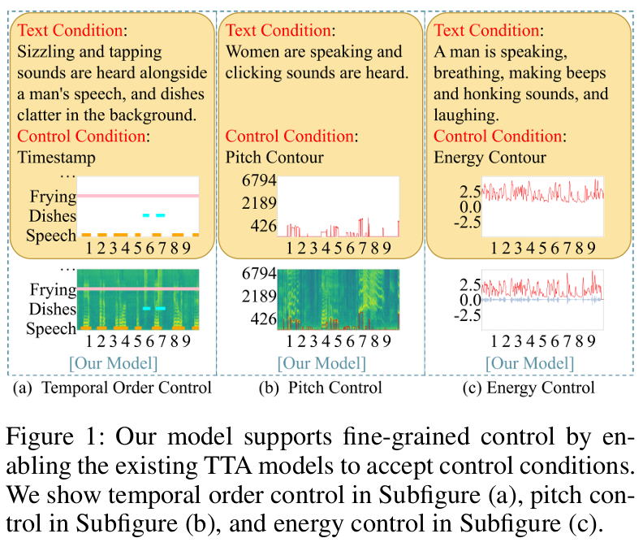
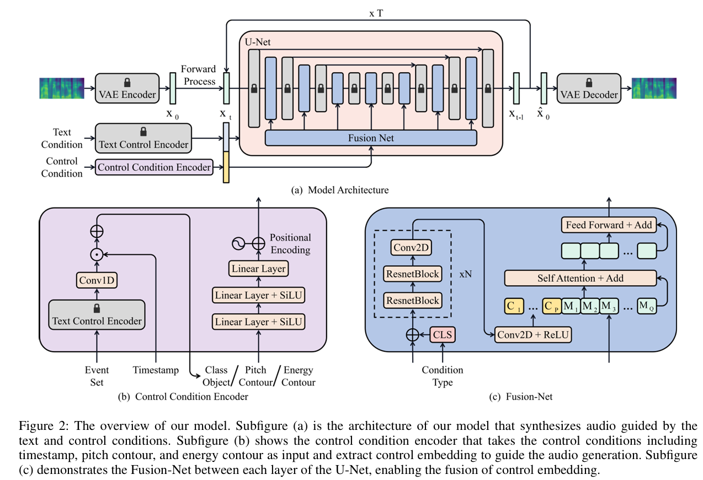
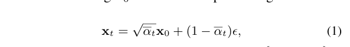
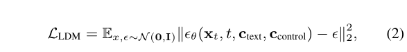

# Audio Generation with Multiple Conditional Diffusion Model
___
##  Abstract
基于文本的音频生成模型存在局限性，因为它们无法涵盖音频中的所有信息，因此在仅依赖文本时可控性会受到限制。为了解决这个问题，我们提出了一种新模型，通过结合内容（时间戳）和风格（音高轮廓和能量轮廓）等附加条件作为文本的补充，增强了现有预训练文本转音频模型的可控性。这种方法实现了对生成音频的时间顺序、音高和能量的细粒度控制。为了保持生成的多样性，我们使用了一个可训练的控制条件编码器，该编码器由大型语言模型和可训练的 Fusion-Net 增强，以对附加条件进行编码和融合，同时保持预训练的文本转音频模型的权重不变。由于缺乏合适的数据集和评估指标，我们将现有数据集合并为一个包含音频和相应条件的新数据集，并使用一系列评估指标来评估可控性性能。实验结果表明，我们的模型成功实现了细粒度控制，从而实现了可控的音频生成。音频样本和我们的数据集均已公开1。
##  Introduction
近年来，生成模型取得了重大进展，在图像（Ramesh 等人 2022；Chen 等人 2020；Nichol 等人 2022）和文本（Radford 等人 2020；Schick 等人 2023；Kong 等人 2020）等不同领域都观察到了增强的自然度。这是由于模型的学习目标更稳定，并且有大量配对数据的可用性。除了这些领域之外，音频生成也引起了广泛关注，在视频创作、虚拟现实和交互系统中具有强大的应用潜力。

音频生成始于标签到音频（Pascual 等 2023；Liu 等 2021b），但生成的音频的多样性受到标签类别的限制。考虑到文本是表达音频需求的更自然的方式，最近对音频生成的研究主要集中于使用字幕（称为文本条件）来生成语义连贯的音频（Yang 等 2022；Kreuk 等 2022；

图 1：我们的模型通过使现有的 TTA 模型接受控制条件来支持细粒度控制。我们在子图 (a) 中显示时间顺序控制，在子图 (b) 中显示音高控制，在子图 (c) 中显示能量控制。

Liu 等人 2023；Huang 等人 2023；Ghosal 等人 2023）。然而，在其他领域，已经提出了许多生成模型来探索使用其他条件（称为控制条件），例如布局（Li 等人 2021a）和关键点（He、Wandt 和 Rhodin 2023）来控制生成过程，甚至同时使用多个条件（Li 等人 2023b）。这些控制条件作为生成过程近似特定分布的指导。然而，在音频领域，很少有关于使用多种条件进行音频生成的研究，而这些条件对于丰富文本条件的表达是必要的。例如，在为视频或虚拟现实生成音频时，指定声音事件的时间位置并精确控制音高和能量以增强用户对场景的沉浸感非常重要。显然，仅通过语言很难精确地传达对音频的细粒度控制意图。因此，使用其他控制条件作为文本条件的补充是合理的，以克服语言表达的局限性并促进模型理解用户的意图。如图1所示，我们的重点是三个关键的控制条件：时间戳、音高轮廓和能量轮廓。这些条件分别用于控制声音事件的时间顺序以及它们的音高和能量。时间顺序可以控制音频的内容，而音高和能量可以控制其风格。所有这些因素都是音频的重要特征。

受到基础文本转图像模型 GLIGEN (Li et al. 2023b) 最新进展的启发，我们提出了一个新模型，该模型通过合并其他控制条件来扩展现有文本转音频 (TTA) 模型的功能，同时保留原始文本条件以进行细粒度控制。我们的方法首先采用共享控制条件编码器对所有控制条件进行编码。我们利用大型语言模型 (LLM) 在各个领域的成功经验 (Chen et al. 2021b; Radford et al. 2021; Ruan et al. 2023)，并利用它们的语义理解能力来获得声音事件类的可区分语义表示。为了确保声音事件的连续性，我们采用帧级语义表示。为了在使预训练模型支持控制条件的同时保持生成的多样性，我们冻结了预训练模型的权重（Zhang 和 Agrawala 2023；Li 等人 2023b），并训练了一个 Fusion-Net，将控制条件信息集成到音频生成过程中。此外，我们使一个模型能够支持多种控制条件，从而允许参数共享并增强特征表示，从而为每种类型的控制条件和参数效率带来好处。

作为首次探索多条件音频生成，目前缺乏专门为此任务设计的数据集和评估指标。因此，我们设计了一个数据集和评估指标作为未来研究的基准：（1）数据集：我们整合现有数据集，为该任务创建一个新的数据集，其中包含音频、相应的文本和控制条件。（2）评估指标：我们采用声音事件检测 (SED) 系统检测结果来衡量时间顺序控制的性能。矩用于评估生成音频的音高分布，并使用平均绝对误差 (MAE) 来计算生成音频的能量与相应参考值之间的相似性。此外，我们请专家聆听声音事件的位置作为主观评估，以补充 SED 系统的结果。音频样本和我们的数据集均公开可用1。

贡献总结如下：

* 我们引入了一项新任务，该任务由文本和控制条件引导生成音频，从而能够使用时间戳、音高轮廓和能量轮廓对音频进行细粒度的定制。

* 我们整合现有的数据集，创建一个包含音频和相应条件的新数据集，并使用一系列评估指标来评估性能，这可以作为未来工作的基准。

* 我们基于现有的预训练 TTA 模型提出了一种音频生成模型，该模型不仅接受文本作为条件，还结合了其他控制条件，以实现对音频生成的更细粒度和更精确的控制。实验结果证明了我们的模型在生成具有更大控制力的音频方面的有效性。

##  Related Work
### Text-Guided Audio Generation
扩散模型 (Ho、Jain 和 Abbeel 2020) 已在各个领域的生成模型中取得了显著的成功，包括图像 (Chen et al. 2021a)、语音 (Kong et al. 2021b) 和视频 (Singer et al. 2022)。然而，扩散模型中高维特征的迭代处理会导致推理速度变慢。为了应对这一挑战，研究人员在迭代过程中降低了特征的维度，大多数音频生成模型都建立在此基础上：首先，使用编码器将音频特征转换为潜在表示。随后，扩散模型在这个潜在空间内运行，并使用解码器将预测结果重建回音频特征。值得注意的是，在此基础上进行了各种改进：DiffSound (Yang 等人，2022 年) 在离散扩散模型中引入了 VQ-VAE (van den Oord、Vinyals 和 Kavukcuoglu，2017) 来处理梅尔频谱图。AudioGen (Kreuk 等人，2022 年) 不是通过梅尔频谱图进行训练，而是直接从原始波形中学习，并在自回归结构下利用无分类器指导 (Jonathan 和 Tim，2022) 来生成音频。最近，Make-an Audio (Huang 等人，2023 年) 和 AudioLDM (Liu 等人，2023 年) 对连续空间内的音频生成进行了探索。此外，为了提高训练效率， Tango (Ghosal et al. 2023) 利用冻结的预训练 LLM 中的语言能力在有限的训练数据集上训练扩散模型。然而，当前的条件主要涉及文本，这对通过自然语言传达附加信息提出了挑战。因此，我们增强了文本引导音频生成模型的控制能力，使其能够由包括内容（时间戳）和风格（音高轮廓和能量轮廓）在内的附加条件引导，这便于用户创建符合其要求的音频。

### 条件生成模型
随着各种配对数据的可用性不断提高，以各种信息为条件的生成模型的开发取得了快速进展，例如文本（Ramesh 等人，2022 年；Liu 等人，2021a）、图像（Huang 等人，2023 年；Li 等人，2023a）、音频（Zelaszczyk 和 Mandz iuk，2021 年；Wangetal.2023）和布局（Jahn、Rombach 和 Ommer，2021 年；Li 等人，2021b），但它们仅依赖于一种条件，限制了所传输的信息。因此，探索如何利用这些生成模型中的现有知识扩展到新条件至关重要。GLIGEN（Li 等人，2023b）通过结合基础条件来控制图像的生成并保留原始文本条件，彻底改变了文本到图像的模型。我们希望探索在音频领域扩展条件的可能性。此外，我们还想挖掘这些不同条件之间的关系及其对音频生成的影响。

图 2：我们模型的概览。子图 (a) 是我们模型的架构，该模型合成由文本和控制条件引导的音频。子图 (b) 显示了控制条件编码器，该编码器以时间戳、音高轮廓和能量轮廓等控制条件为输入，并提取控制嵌入以指导音频生成。子图 (c) 演示了 U-Net 各层之间的 Fusion-Net，从而实现了控制嵌入的融合。

## Method
在本节中，我们首先介绍模型的架构。随后，我们介绍处理控制条件的方法和具体细节。最后，我们说明使用控制条件增强现有 TTA 模型的方法。
### Overview
我们的模型由一个文本条件编码器、一个控制条件编码器、一个条件潜在扩散模型 (LDM)、一个变分自动编码器 (VAE) (Kingma 和 Welling 2013) 和一个 Fusion-Net 组成。文本和控制条件编码器分别提取相应的嵌入。在文本和控制嵌入的指导下，使用来自 VAE 编码器的噪声梅尔嵌入 (用于训练) 或标准高斯噪声 (用于测试) 来构建潜在表示，然后由 VAE 解码器将其重建回梅尔频谱图。我们使用声码器生成最终音频。为了保留生成能力，我们冻结 VAE、文本条件编码器和条件潜在扩散模型，并使用来自预训练的 TTA 模型 Tango (Ghosal 等人 2023) 的权重。我们的模型概览如图 2 (a) 所示。

文本条件编码器 由于指令调整后的 LLM 显著提升了 TTA 模型 (Ghosal et al. 2023) 的性能，我们使用预训练的 LLM FLAN-T5-LARGE (Chung et al. 2022) 作为文本条件编码器，以生成具有丰富语义信息的文本嵌入。并且文本条件编码器的参数在训练阶段被冻结，以保持原始的语义表示能力。

控制条件编码器 如图 2 (b) 所示，控制条件编码器将控制条件作为输入，包括时间戳、音调轮廓和能量轮廓。对于时间顺序控制，我们利用从 FLAN-T5-LARGE 派生的语言知识来生成事件类的语义表示，并将其与时间戳一起转换为类对象。然后使用相同的多层感知器和位置嵌入处理类对象、音调轮廓和能量轮廓，以生成相同维度的控制嵌入，这将在控制条件预处理小节中讨论。

条件潜在扩散模型 我们的模型可以看作是一个 LDM，它依赖于包括噪声 mel 嵌入 xt、文本嵌入 ctext 和控制嵌入 ccontrol 在内的条件。mel 嵌入 xt 是通过在保留方差的情况下对初始 mel 嵌入 x0 进行扩散（前向）处理获得的：

其中 t 是从时间步骤 {1,··· ,T} 均匀采样的，ϵ 是标准高斯噪声，αt = t s=1(1−βs) 基于 预定义的噪声计划 βs。我们的目标是对 mel 嵌入 xt 或 标准高斯噪声 ϵ 进行去噪（逆）过程，返回到 mel 嵌入 ˆ x0。 对于每个步骤 t，LDM 训练目标解决去噪问题：

其中 ϵθ 是 (t,ctext,ccontrol) 条件下的噪声估计。LDM 架构主要依赖于具有交叉注意机制 (Vaswani 等人 2017) 的 U Net (Yang 等人 2022)，该机制由一系列 ResNet (He 等人 2016) 和 Transformer 块 (Vaswani 等人 2017) 组成。与标准扩散模型类似，它以噪声 mel 嵌入 xt 和时间步长 t 作为输入，并受文本嵌入 ctext 的条件影响来预测噪声估计 ϵθ。在每个 Transformer 块中，都包含一个交叉注意层来融合时间步长 t 和文本嵌入 ctext。为了保留原始 TTA 模型的生成能力，我们冻结了 U-Net 每一层的参数。

Fusion-Net 为了将控制嵌入控制合并到 LDM 中，我们在冻结 U-Net 的每一层之间引入了一个可训练的 Fusion-Net ，这将在控制条件融合小节中讨论。

变分自动编码器 VAE（Kingma 和 Welling 2013）由一个编码器和一个解码器组成，后者将梅尔频谱图压缩到梅尔嵌入 x0 中，并从梅尔嵌入 ˆ x0 重建梅尔频谱图。 VAE 使用 ResUNet 块（Kong 等人，2021a）构建，并使用 ELBO（Kingma 和 Welling 2013）和对抗性损失（Isola 等人，2017）的组合进行训练。我们使用来自 AudioLDM（Liu 等人，2023）的 VAE 检查点并冻结其参数。

