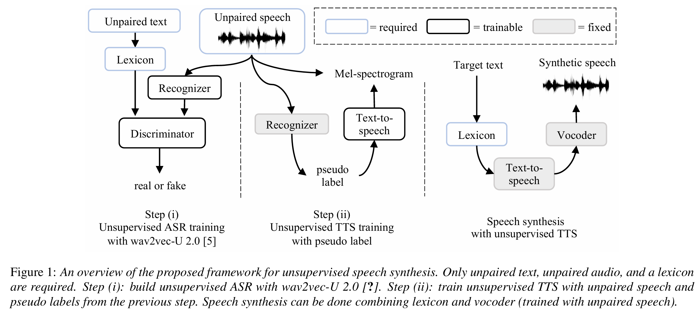

## Simple and Effective Unsupervised Speech Synthesis
___
###  Abstract
我们引入了第一个基于简单但有效的方法的无监督语音合成系统。该框架利用了无监督语音识别的最新成果以及现有的基于神经的语音合成。我们的方法仅使用未标记的语音音频和未标记的文本以及词典，无需人工标记的语料库即可实现语音合成。实验表明，无监督系统可以合成与监督系统类似的语音，在人工评估的自然度和可理解性方面。
索引词：语音合成、无监督学习
###  1. Introduction
随着深度学习的最新进展，基于神经的文本转语音 (TTS) 系统在可理解性和自然度方面缩小了真实语音和合成语音之间的差距 [1]。然而，合成高质量语音需要由语音文本对组成的大量数据集 [2]。因此，语音合成系统不适用于绝大多数语言 [3]。

在这项初步研究中，我们首次尝试（尽我们所知）实现无监督语音合成，目的是解决上述语音合成的局限性。我们通过仅考虑不成对的音频、不成对的文本和字素到音素词典来模拟一种极端情况，即人工注释的语音不可用。我们提出了一种简单的两步方法来在这种情况下构建 TTS 系统：首先，利用自动语音识别 (ASR) 模型为未转录的语音提供伪标签；其次，仅使用机器注释的语音训练 TTS 模型。

第一步，我们利用无监督语音识别的最新成果 [4]。我们训练 wav2vec-U 2.0 [5]，这是一种不需要配对语音和文本数据的 ASR 模型，用于获得伪语音到文本的注释。第二步，为了构建语音合成系统，我们遵循与现有监督 TTS 模型 [6] 相同的学习范式，但使用机器注释的语音而不是人工注释的数据。

在我们的实验中，我们证明了这种简单方法的有效性。我们通过进行客观和主观测试，证明了无需人工标记数据，即可合成清晰自然的语音。我们还证明了，尽管从不完美的转录中学习，但无监督 TTS 的表现可以与监督 TTS 相媲美。

### 2. Background
####  2.1. Supervised Speech Synthesis
虽然语音合成的方法有很多种，但我们主要关注基于神经网络的 TTS 系统，其中文本到语音的映射由深度神经网络使用编码器-解码器架构建模 [6、7、8]。在序列到序列编码器-解码器范式下，输入文本首先借助词典转换为音素序列，然后使用编码器编码为潜在特征。自回归解码器根据编码器特征预测梅尔声谱图。可以通过最小化目标梅尔声谱图的重建误差来训练整个模型。

除了文本到声谱图模型之外，神经声码器也在基于神经的 TTS 系统中发挥着重要作用 [9]。声码器旨在通过从音频数据中收集的 <波形，梅尔声谱图> 对中学习，从合成梅尔声谱图生成波形。结合文本到梅尔声谱图 TTS 模型和神经声码器，可以合成与真实数据难以区分的高质量语音 [10, 1]。尽管如此，高质量的基于神经的 TTS 系统仍然需要大量人工注释的语音。
####  2.2. Semi-supervised Speech Synthesis
为了提高基于神经的 TTS 系统的数据效率，利用非配对训练数据的方法蓬勃发展。与配对的 <音频，文本> 数据不同，收集非配对文本或非配对音频相对简单。先前的研究发现，使用非配对数据和配对数据的半监督学习可以通过不同的方式减少对配对数据的需求。例如，预训练编码器/解码器 [2]、改进输入文本表示 [11, 12] 以及使用 ASR 和 TTS 的相反性质进行数据增强 [13, 14, 15]。然而，现有的半监督方法仍然受到配对训练数据数量的限制 [2, 14, 15]。在这项工作中，我们通过不使用配对训练数据来突破基于神经的 TTS 系统的极限。
####  2.3. Unsupervised Speech Recognition
由于使用所提出的方法实现无监督语音合成的关键是在没有成对的<音频，文本>数据的情况下生成语音转录，因此我们首先回顾一下无监督语音识别方面的前期工作。Wav2vec-U [4] 通过使用自监督语音表示 [16]，在没有成对数据的情况下实现了良好的语音识别性能。该方法首先使用 wav2vec 2.0 [16] 嵌入未标记的语音数据，然后通过对 wav2vec 2.0 表示进行聚类来确定段边界。接下来，该方法通过对 wav2vec 2.0 表示执行 PCA 降维来构建段表示，然后汇集特定段中所有时间步长的特征。然后将这些表示输入到生成器以执行对抗性训练。文本数据也通过字素到音素的转换进行预处理，同时在每个句子周围填充静音，并在单词之间随机插入静音。最后，对抗训练通过将预处理后的特征映射到电话序列来获得语音识别器。在这里，我们使用改进的版本 wav2vec-U 2.0 [5]，它直接在原始音频上训练识别器，而无需对音频进行特殊的预处理（图 1），即通过消除确定段边界和预处理 wav2vec 2.0 特征的需要。wav2vec-U 的主要变化是输出具有更大步幅的电话预测，从而可以消除大部分预处理。

图 1：无监督语音合成的拟议框架概述。只需要不成对的文本、不成对的音频和词典。步骤 (i)：使用 wav2vec-U 2.0 [?] 构建无监督 ASR。步骤 (ii)：使用上一步中的不成对语音和伪标签训练无监督 TTS。语音合成可以结合词典和声码器（使用不成对语音训练）完成。

###  3. Unsupervised TTS
#### 3.1. Problem formulation
作为第一项针对无监督 TTS 的研究，我们的目标是使用以下资源合成语音：
* 包含不带配对文本的语音的音频语料库。
* 文本语料库包含的句子与口语语料库不完全匹配。此外，文本和音频语料库之间不存在领域不匹配。
* 提供文本语料库中每个单词的发音表示（即音素序列）的词典。
我们提出了一种使用这些资源构建无监督 TTS 的流水线方法。训练过程分为两个步骤，如下节所述。
####  3.2. Pseudo labeling speech via unsupervised ASR、
如图 1(i) 所示，所提方法的第一步是为口语语料库中的每个话语生成伪标签。为此，我们首先在非配对音频和文本上训练 wav2vec-U 2.0 [5]，这是一种现有的无监督语音识别方法，在第 2.3 节中描述，在第 4.2 节中详细介绍。训练后，可以使用生成的识别器对音频语料库进行解码，以获得伪标记的音素序列。
####  3.3. Unsupervised text-to-speech with pseudo label
对于第二步，我们使用伪标记音频语料库训练序列到序列 TTS，如图 1(ii) 所示，并在第 4.3 节中详细介绍。TTS 模块的目标是学习恢复包含由不完善的输入音素注释指定的口语内容的梅尔声谱图。在测试期间，可以通过输入所需句子的音素序列表示来合成梅尔声谱图。为了生成可听见的语音，使用单独的声码器将梅尔声谱图转换为波形。最后一步本质上是无监督的，因为训练声码器不需要文本。
