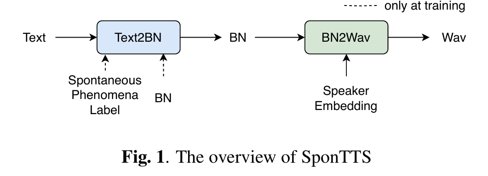
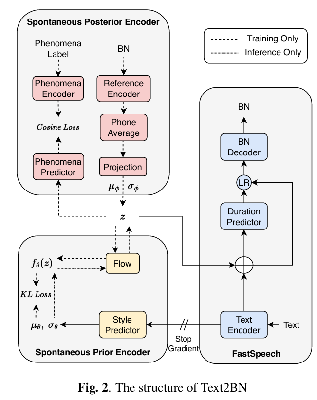
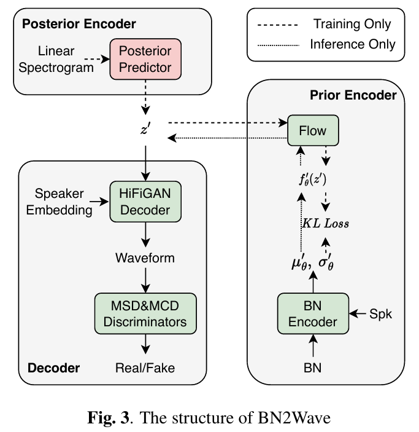

# Spontts: Modeling and Transferring Spontaneous Style for TTS
___
## ABSTRACT
自发说话风格与其他说话风格有显著差异，这是由于各种自发现象（例如，填充停顿、延长）和大量的韵律变化（例如，不同的音调和持续时间变化，偶尔的非语言语音，如微笑），对自发风格的建模和预测提出了挑战。此外，高质量自发数据的限制限制了没有自发数据的说话者的自发语音生成。为了解决这些问题，我们提出了 SponTTS，这是一种基于神经瓶颈 (BN) 特征的两阶段方法，用于为 TTS 建模和传输自发风格。在第一阶段，我们采用条件变分自动编码器 (CVAE) 从 BN 特征中捕获自发韵律，并通过自发现象嵌入预测损失的约束来涉及自发现象。此外，我们引入了一个基于流的预测器来从文本中预测潜在的自发风格表征，从而丰富了推理过程中的韵律和特定于上下文的自发现象。在第二阶段，我们采用类似 VITS 的模块将第一阶段学习到的自发风格迁移到目标说话者。实验表明，SponTTS 能够有效地对自发风格进行建模，并将风格迁移到目标说话者，生成具有高自然度、表现力和说话者相似度的自发语音。零样本自发风格 TTS 测试进一步验证了 SponTTS 在为看不见的说话者生成自发语音方面的泛化和鲁棒性。  
索引词——富有表现力的语音合成、自发性语音、风格转换
##  1. INTRODUCTION
​        语音合成或文本转语音 (TTS) 的主要目标之一是生成听起来尽可能自然和像人类的语音。自发式语音合成旨在复制人类自然说话的方式，包括音调、语速、音调变化和各种自发事件。随着深度学习的快速发展，语音合成在合成高度自然的语音方面取得了显著进展，其质量接近甚至几乎与人类语音难以区分 [1, 2, 3, 4]。然而，现有的 TTS 系统在生成自发式语音方面表现不佳。  
​        为了提供风格化的语音，典型的语音合成系统通常采用参考编码器来捕捉参考音频中的韵律变化 [5]，其中始终需要参考音频来捕捉所需的说话风格。然而，找到适合自发语音合成的音频参考是不切实际的，因为自发语音通常以特定于上下文的自发现象为特征 [6, 7, 8]，例如填充停顿、语速变化和重音等。  
​        使用显式现象标签来建模自发风格是一种典型的解决方案 [9, 10]。尽管这些方法证明了自发现象对于自发语音生成的可行性和可控性，但它们忽略了自发语音中无法准确标记的内在韵律渲染，例如不同的音调和持续时间变化以及偶尔的非语言语音，导致合成语音的表现力有限。少数研究 [11] 手动计算韵律统计数据来建模自发韵律，但没有考虑自发现象，导致合成语音中缺乏自然的自发现象表达。  
​	此外，先前的研究报告称，由于不流畅和大量的韵律变化，自发语音与阅读风格的语音相比表现出显着差异[12，13，14]，这在推理过程中从文本中预测自发风格表现时带来了重大挑战。一些作品[9，10]采用了额外的基于文本的预测器来预测自发现象标签，当现象标签不合理地出现时，可能会产生不自然的语音。此外，虽然可以通过在推理过程中手动指定自发现象标签来合成具有各种自发现象的自发语音，但在实际应用中并不实用。最近的一项研究[15]预测了与TTS模型联合训练的软现象标签嵌入，以减少生成语音中预测误差的累积。与这些作品不同，在本文中，我们预测了一种潜在的自发风格表现，它涉及更丰富的自发韵律和更多类型的自发现象。  
此外，自发风格转换旨在为没有自发风格数据的说话者合成自发风格的语音，这是一种缓解数据限制和丰富语音表现力的实用方法。然而，由于自发语音中的特定文本模式以及自发风格和说话者身份之间的纠缠关联，这种方法具有挑战性。之前的一些研究 [16] 探索了基于语音转换的数据增强在自发风格转换中的作用，但它受到语音转换系统质量的限制。从训练有素的自动语音识别 (ASR) 模型中提取的瓶颈 (BN) 特征被认为是语言和风格丰富的，但与说话者无关，并广泛用于 TTS 中的情感和风格转换 [17, 18, 19]，这启发我们使用 BN 特征进行自发风格建模和转换。  
本文提出了一种新颖的 TTS 方法，用于为 TTS 建模和迁移自发风格，即 SponTTS，这是一个基于 BN 特征的两阶段框架。在第一阶段，我们采用条件变分自动编码器 (CVAE) 来学习自发风格的潜在表示，从 BN 特征中捕获自发韵律，并通过自发现象嵌入预测损失的约束来提供自发现象。此外，我们利用基于流的预测器从文本中预测潜在表示，这丰富了推理过程中的韵律和上下文特定现象。在第二阶段，我们采用类似 VITS 的模块将第一阶段学习到的自发风格迁移到目标说话者，无论是在训练数据集中看到还是看不到，仅使用阅读风格数据。客观和主观实验表明，SponTTS 有效地模拟了自发的语音风格，并成功地将其迁移到目标说话者，生成具有高自然度、表现力和说话者相似性的自发语音。零样本自发式 TTS 测试进一步验证了 SponTTS 在为未见过的说话者生成自发式语音方面的泛化和稳健性。我们建议读者听听我们的在线演示1。
##  2. SPONTTS
如图 1 所示，基于 BN 特征，我们分两个阶段训练 SponTTS。第一阶段是 Text-to-BN (Text2BN)，旨在在从 BN 和自发现象标签中学习到的自发风格表征 z 的条件下，将文本映射到与说话人无关的 BN 特征，同时呈现自发韵律和自发现象。第二阶段是 BN-to-Wave (BN2Wave)，旨在根据说话人嵌入直接从 BN 生成波形，为训练中未见过的任何人实现自发风格的语音合成。
  
###  2.1. Text-to-BN module
Text2BN 的结构如图 2 所示，它遵循 FastSpeech [20] 作为将文本映射到 BN 的主干。它主要包括三个关键组件：文本编码器、长度调节器和 BN 解码器。文本编码器将文本作为输入并产生音素级编码输出，然后长度调节器根据从持续时间预测器预测的持续时间将其扩展到帧级，并由 BN 解码器使用以生成 BN 特征。为了对自发风格进行建模，我们提出了一种 CVAE 结构，以在自发后验编码器中从 BN 特征 xbn 获得后验分布 qϕ(z|xbn)。我们通过加法运算将 z 与文本编码器输出相结合以进行 BN 预测。此外，提出了一种基于流的自发先验编码器，该编码器与主干和自发后验编码器联合优化，以获取特定于话语的先验分布，然后在推理过程中从先验分布中采样自发风格表征 z。  
  
自发后验编码器 我们设计了一个自发后验编码器来捕捉各种自发现象和多样的自发韵律。我们首先采用参考编码器从目标语音 xbn 中提取的 BN 特征中学习帧级表示，并根据通过基于 HMM 的力对齐模型获得的持续时间执行音素级平均池化，以将表示下采样到音素级。随后，我们采用重新参数化技巧 [21] 从投影层学习的平均值 µϕ 和方差 σϕ 中获取自发风格潜在表示 z。为了鼓励与自发现象知识相关的后验分布 qϕ(z|xbn)，我们引入了一个现象预测器作为对 z 的约束，以最小化从 z 预测的自发现象嵌入与从自发现象标签获得的地面真实自发现象嵌入之间的距离。这种约束方法可以避免使用单独的分类器对不同类别的自发现象进行建模时出现的不稳定问题。后验分布可以表示为：  
  
自发先验编码器 我们引入一个自发先验编码器，从文本编码器输出 c 中获得先验分布 N(µθ(c),σθ(c))，如图 2 左下方所示。受 VITS [4] 启发，我们使用归一化流 fθ 将先验分布 p(fθ(z)|c) 映射到更复杂的分布，从而增强推理过程中从文本预测的韵律方差：  
  
Text2BN模块Lt2bn的训练目标是：  
  
其中 LBN 是预测 BN 与真实 BN 之间的 L2 重构损失；Ldur 是 L2 持续时间预测损失。Lphen 是用于现象预测的余弦距离损失；Lstyle 是用于自发韵律预测的 Kullback-Leibler 散度 (KLD)，其中我们使用 α 来退火 KLD 损失以解决 KL 崩溃问题。    
### 2.2. BN-to-Wave module
我们按照 VITS [4] 构建了 BN2Wave，它由先验编码器、后验编码器和解码器组成，如图 3 所示。在先验编码器中，BN 编码器和流生成 CVAE 的先验分布 pθ(z′|c′)，其中 c′ 是条件信息，包括 BN 特征 xbn 和说话人嵌入 spk。后验编码器主要组成后验预测器，以线性频谱 xlin 作为输入并产生后验分布 q(z′|xlin)。后验预测器由 WaveNet 残差块堆栈组成 [22]。最后，HIFI-GAN [3] 解码器根据说话人嵌入从 z′ 生成可听波形。我们利用预先训练的说话人验证模型而不是查找表来获得更稳定、更鲁棒的说话人嵌入，期望实现说话人自适应的自发语音合成。  
  
    
我们利用 L1 损失作为重构损失 Lrec 来最小化真实波形和预测波形的梅尔频谱图之间的距离。此外，与 VITS [4] 类似，解码器集成了对抗训练损失 Ladv 和特征图损失 Lfm，以进一步提高波形生成的性能。BN2Wave 模块 Lbn2w 的训练目标是  
  
其中 LGbn2w、LDbn2w 和 Lkl 分别是隐藏分布的生成损失、鉴别器损失和 KL 散度。与 HiFi GAN[3] 相同，我们将梅尔谱的损失率设置为 45。
