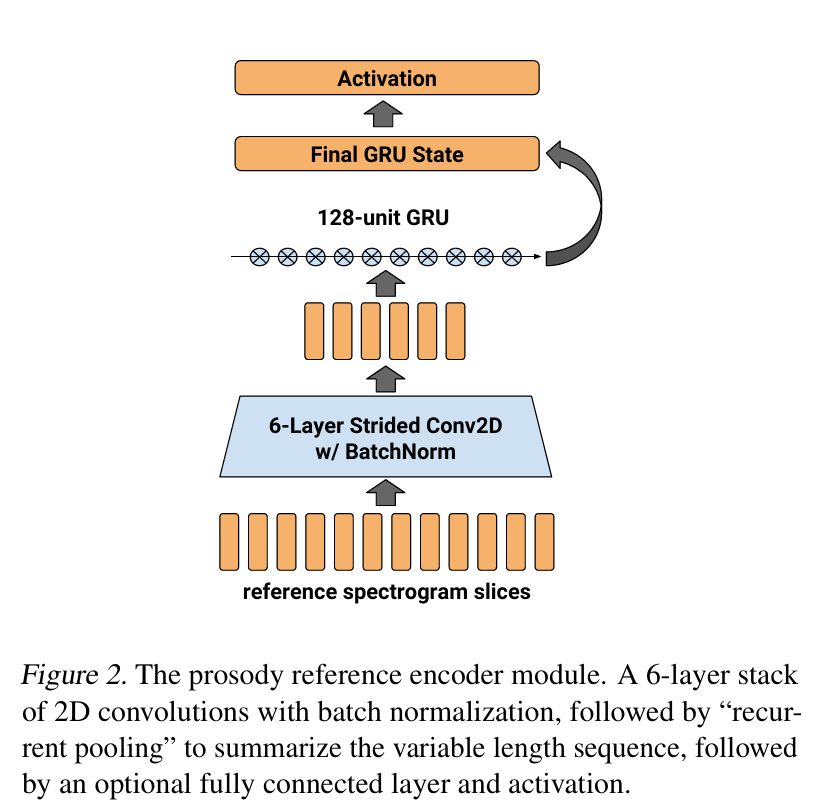
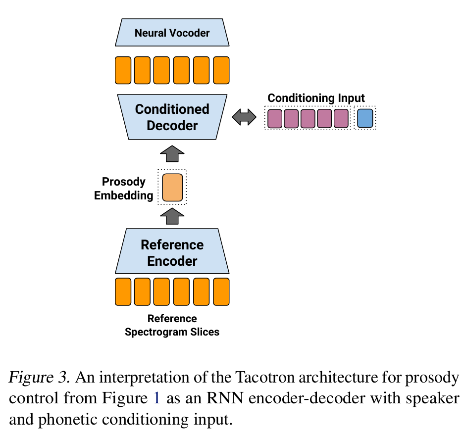

# Towards End-to-End Prosody Transfer for Expressive Speech Synthesis with Tacotron
___
##  Abstract
我们提出了 Tacotron 语音合成架构的扩展，该架构学习韵律的潜在嵌入空间，该空间源自包含所需韵律的参考声学表示。我们表明，在这个学习到的嵌入空间上调节 Tacotron 会产生与参考信号的韵律相匹配的合成音频，即使参考和合成说话者不同，也能提供精细的时间细节。 此外，我们表明，参考韵律嵌入可用于合成与参考话语不同的文本。 我们定义了几个定量和主观指标来评估韵律转移，并在韵律转移任务中报告结果以及来自单说话者和 44 说话者 Tacotron 模型的音频样本。  
## 1. Introduction
为了产生逼真的语音，文本转语音 (TTS) 系统必须隐式或显式地引入许多简单的文本输入无法提供的因素。这些因素包括语音的语调、重音、节奏和风格，统称为韵律。  
通过文本到语音进行语音合成是一个具有挑战性的欠确定问题，因为话语所表达的含义本质上是文本未充分指定的。例如，简单的语句“猫坐在垫子上。”可以用许多不同的方式来表达。如果该语句是“猫坐在哪里？”这个问题的答案，那么说话者可能会强调“垫子”这个词来表明它是问题的答案。为了表达他们知识中的不确定性，说话者可能会决定用上升的音调来回答。问题“你想要一个苹果还是一个橘子？”也可以用多种方式说出，表明有关存在的一组对象的信息。如果只有两个可能的选项，那么最后一个选项（“橘子”）的语调将具有下降的音调。如果有多种选择，其中苹果和橘子只是两个例子，那么这两个选项通常都以上升的音调吟唱。这些句子的语调带有文本未指定的问题环境或上下文的含义，并且一般来说，语音中存在许多这样的细微差别，它们传达了文本内容以外的信息。  
为了避免对韵律进行图式化和标记的难题，我们寻求不需要明确注释的韵律建模方法，并提出了一种通过从真实语音音频中提取潜在韵律表示来学习潜在韵律表示的架构。因此，我们使用了韵律的“减法”定义：  
定义。韵律是语音信号中的变化，在考虑了语音、说话者身份和通道效应（即录音环境）造成的变化后仍然存在。  
这种对韵律的看法与先前著作中对韵律的解释相一致 (Wagner & Watson, 2010; Ladd, 2008)。  
这种表述自然会产生一个问题，那就是采样——即，即使对于相同的语音、说话者身份和通道效果，也需要生成多样且有趣的韵律和输出语音。在本文中，我们解决了构建表示韵律的空间这一更基本的问题。我们提出了一种可能的韵律潜在空间的构造，并表明我们通过展示此空间中的迁移（即使用潜在表示使一个话语听起来像另一个话语）来捕捉语音中有意义的变化：这大致相当于“像这样说”的任务。  
最近提出的 Tacotron 语音合成系统 （Wang et al.，2017a）直接从字素或音素计算其输出，其韵律模型是隐式的，仅从训练数据的统计数据中学习。例如，它学习到，如果问题的答案是是或否，则以问号结尾的英文句子很可能具有上升音调。在这项工作1中，我们用显式韵律控制增强了 Tacotron。我们通过学习一种编码器架构来实现这一点，该架构从语音信号计算低维嵌入，其中嵌入提供文本和说话者身份未提供的信息。通过仔细的实验​​，我们证明这种韵律嵌入可用于使用 Tacotron 重现所需的韵律。
这种声学编码器架构和韵律潜在空间的直接含义是，我们可以使用与训练时不同的声音来控制 TTS 系统的行为。生成的嵌入长度固定，通常比转录本小，因此可以轻松地与文本一起存储以用于生产系统。长期含义是，我们可以构建模型，从非声学上下文（例如韵律标签或对话状态）预测韵律嵌入。  
我们的主要贡献是一种编码器架构，它从声学输入中提取固定长度的韵律学习表示；我们证明，这种编码器允许我们以几乎与说话者无关的方式在包含相似文本的话语之间传输韵律。为了评估此韵律传输任务中的表现，我们提出了许多定量和定性指标。此外，我们强烈建议读者收听我们演示页面上的音频样本。  
##  2. Related Work
自基于 HMM 的 TTS 研究时代以来，人们一直在研究韵律和说话风格的建模。例如，(Eyben et al., 2012) 提出了一种系统，该系统首先对训练集进行聚类，然后执行基于 HMM 的聚类自适应训练。(Nose et al., 2007) 建议为一组预定义的风格向量估计一个转换矩阵。  
许多作品探索了用于绘制和自动标记韵律的注释方案：ToBi（Silver man 等人，1992 年）、AuToBI（Rosenberg，2010 年）、Tilt（Taylor，1998 年）、INTSINT（Hirst，2001 年）和 SLAM（Obin 等人，2014 年）都描述了用于注释和自动提取与韵律现象相关的标签或注释的方法。然而，注释的挑战通常需要领域专家，并且评分者之间的注释可能有很大差异（Wightman，2002 年）。  
很少有研究提出使用声学参考信号来控制文本转语音模型的韵律。(Tesser 等，2013) 建议使用“信号驱动”特征来预测符号韵律表示，使用 AuToBI 标签来改进基于 HMM 的合成。(Coile 等，1994) 建议通过名为 PROTRAN 的系统进行“韵律移植”，以录制低比特率的“丰富语音转录”，可与所需文本结合使用以重现原始录音的韵律。请注意，(Coile 等，1994) 中描述的相同产品需求推动了本文的发展。  
韵律转换与语音转换任务相关（在音频环境中也称为风格转换）。要执行语音转换，模型必须合成一个话语，仅给出该话语以不同说话者的声音信号（Wu 等人，2013 年；Nakashika 等人，2016 年；Kinnunen 等人，2017 年；van den Oord 等人，2017 年；Chorowski 等人，2017 年）。在（Wang 等人，2018 年）中可以找到与我们类似的方法，其中使用更复杂的自动编码器以无监督的方式学习一些风格元素。  
##  3. Model Architecture
我们的模型基于 Tacotron (Wang et al., 2017a)，这是最近提出的最先进的端到端语音合成模型，可直接从字素或音素序列预测梅尔频谱图。预测的梅尔频谱图可以通过 WaveNet 声码器 (Shen et al., 2017) 直接合成到时域，也可以先学习线性频谱图预测网络，然后应用 Griffin-Lim 频谱图反转 (Griffin & Lim, 1984)。  
在本研究中，我们使用了 (Wang et al., 2017a) 中的原始编码器和解码器架构，而不是 (Shen et al., 2017) 提出的简化架构。此外，我们专门使用由文本规范化前端和词典生成的音素输入，因为我们特别感兴趣的是解决韵律问题，而不是模型从字素中学习发音的能力。最后，我们使用 (Graves, 2013) 的 GMM 注意力机制，而不是 (Wang et al., 2017a) 中使用的 Bahdanau 基于内容的注意力机制，我们发现这可以提高对长语句的泛化能力。  
我们的演示页面中包含的音频样本是用 WaveNet 声码器 (Shen et al., 2017) 制作的；但是，原始线性声谱图预测网络，然后是来自 (Wang et al., 2017a) 的 Griffin-Lim 声谱图反转，对于韵律迁移同样有效。在实践中，我们发现神经声码器的选择只会影响音频保真度，而不会影响系统产生的韵律。  
### 3.1. Multi-speaker Tacotron
(Wang et al., 2017a) 中提出的 Tacotron 不包括说话人身份的明确建模；然而，由于全神经序列到序列模型的灵活性，通过说话人身份条件学习多说话人模型非常简单。我们遵循类似于 (Arık et al., 2017) 的方案来建模多个说话人。  
  
Tacotron 架构以转录编码器架构生成的音素或字素序列的 LT dT 维表示为基础来调节自回归解码器，其中 LT 是编码转录表示的长度（通常等于输入转录的长度），dT 是转录编码器生成的嵌入维度。对于数据集中的每个说话人，使用 Glorot（Glorot & Bengio，2010）初始化 RdS 嵌入向量。对于每个示例，与示例的真实说话人相对应的 dS 维说话人嵌入被广播连接到 LT dT 维转录编码器表示，以形成解码器将关注的 (dT + dS) 维编码器嵌入序列。无需额外的更改或损失指标。对于单说话人数据集，我们不使用说话人嵌入。  
### 3.2. Reference Encoder
我们通过添加“参考编码器”模块扩展了 Tacotron 架构，该模块以长度 LR 和 dR 维参考信号作为输入，并从中计算 dP 维嵌入。此固定维嵌入的实例定义了一个“韵律空间”——我们的目标是从这个空间采样将产生多样化且合理的输出语音，并且我们可以操纵这个空间的元素来有意义地控制输出。  
与说话人嵌入一样，此韵律嵌入通过广播连接与 LT dT 文本编码器表示相结合。与第 3.1 节中描述的说话人嵌入相结合，编码器嵌入形成 LT (dT +dS+dP) 嵌入矩阵，其中说话人和韵律嵌入在所有时间步上都是固定的。图 1 说明了此结构。  
在训练期间，参考声学信号只是被建模的目标音频序列。没有使用显式监督信号来训练参考编码器；它是使用 Tacotron 的重构误差作为其唯一损失来学习的。在训练中，可以将组合系统视为 RNN 编码器-解码器（Cho et al., 2014a），以语音和说话者信息作为条件输入。对于足够高容量的嵌入，此表示可以简单地学习在训练期间将输入复制到输出。因此，与自动编码器一样，必须小心选择一种足以限制韵律嵌入的架构，使其被迫学习紧凑的表示。  
  
在推理过程中，我们可以使用韵律参考编码器对任何话语进行编码：我们不必匹配文本输入或说话者身份。特别是，这使得韵律转移成为可能——使用不同说话者的话语或不同的文本来控制输出。我们将在第 4 节详细研究韵律转移。  
对于参考编码器架构（图 2），我们使用一个简单的 6 层卷积网络。每层由 3 个步长为 2 个的滤波器组成，使用“相同”填充和 ReLU 激活。批量归一化（Ioffe &Szegedy，2015）应用于每一层。每层中的滤波器数量以下采样率的一半加倍：32、32、64、64、128、128。  
该架构在两个维度上对 LR dR 参考信号进行了 64 次下采样。最终卷积层的 dR 64 特征维度和 128 个通道展开为最终 LR 64 128dR 64 矩阵的内维度。为了将 CNN 层生成的 LR 64 长度序列压缩为单个固定长度向量，我们使用了一个具有单个 128 宽度门控循环单元 (GRU) (Cho et al., 2014b) 层的循环神经网络。我们将 GRU 的最终 128 维输出作为序列的池化摘要。  
为了从 GRU 的 128 维输出计算最终的 dP 维嵌入，我们应用全连接层将输出投影到所需的维度，然后使用激活函数（例如 softmax、tanh）。激活函数的选择可以限制嵌入中包含的信息，并通过控制其幅度使学习更容易。经过一些探索，我们发现 128 的 dP 和 tanh 激活在实践中表现良好。 
###  3.3. Reference signal feature representation
选择用作参考编码器架构输入的 LR dR 特征表示自然会影响我们可以期望学习的韵律方面。例如，音高轨迹表示不允许我们在某些语言中建模突出性，因为它不包含能量信息。同样，MFCC 表示可能在某种程度上是音高不变的（取决于保留的系数数量），从而阻止我们建模语调。在这项工作中，我们决定使用与 (Wang et al., 2017a) 相同的感知相关频谱摘要：梅尔扭曲频谱 (Stevens et al., 1937)。与 (Wang et al., 2017a) 一样，我们使用从 80 到 12000 Hz 的 80 个梅尔波段。  
这种表示选择使得我们能够将最终的架构解释为基于文本和说话者身份的 RNN 编码器-解码器 (Cho et al., 2014a)。它必须通过瓶颈表示对信号中无法解释的变化进行建模，即韵律和录音环境。我们在图 3 中说明了这种解释。  
  
我们还探索了更紧凑的表示形式，例如音调轨迹和强度，但梅尔频谱图产生了最佳效果。  
###  3.4. Variable Length Prosody Embeddings
使用固定长度的韵律嵌入会造成明显的扩展瓶颈，从而阻碍将这种方法扩展到更长的话语。第 3.2 节中的参考编码器的另一种实现在每个时间步骤中使用 GRU 的输出，而不仅仅是最终输出。与固定长度编码器一样，每个 GRU 输出都通过完全连接的层以将其转换为所需的维度。这可以解释为类似于 (Coile et al., 1994) 中提出的增强语音转录的低比特率韵律表示。为了在这个序列上调节 Tacotron 解码器，我们引入了第二个注意力头，其中包含一个注意力聚合器模块，如 (Wang et al., 2017b) 中提出的那样。在我们的实验中，可变长度的韵律嵌入能够推广到非常长的话语；然而，与固定长度的嵌入相比，可变长度的嵌入对文本和说话者扰动的鲁棒性较差，可能是因为它们编码了更强的时间信号。因此，本文重点关注固定长度的嵌入。
