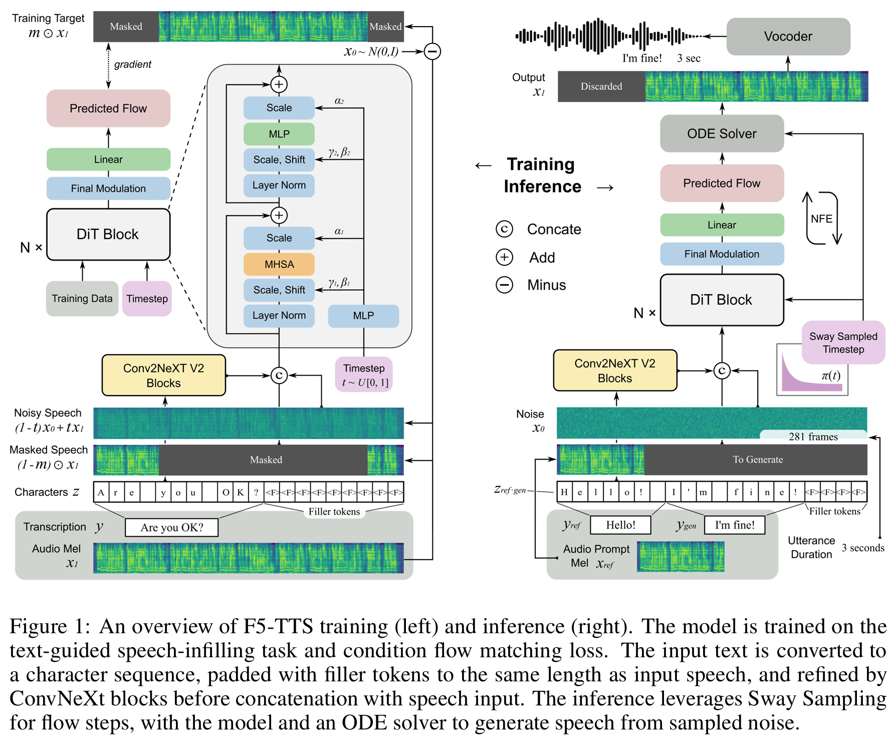
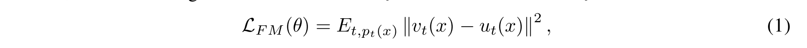
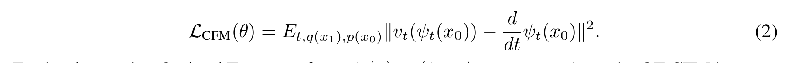

## F5-TTS: A Fairytaler that Fakes Fluent and Faithful Speech with Flow Matching
___
### Abstract
本文介绍了基于流匹配和扩散变换器 (DiT) 的完全非自回归文本转语音系统 F5-TTS。无需时长模型、文本编码器和音素对齐等复杂设计，只需用填充标记填充文本输入，使其长度与输入语音相同，然后进行去噪以生成语音，这最初由 E2 TTS 证明是可行的。然而，E2 TTS 的原始设计由于其收敛速度慢和鲁棒性低而难以遵循。为了解决这些问题，我们首先使用 ConvNeXt 对输入进行建模以细化文本表示，使其易于与语音对齐。我们进一步提出了一种推理时间摆动采样策略，这显著提高了我们模型的性能和效率。这种流步骤采样策略可以轻松应用于现有的基于流匹配的模型，而无需重新训练。我们的设计可以加快训练速度，并实现 0.15 的推理 RTF，与最先进的基于扩散的 TTS 模型相比，这一性能得到了极大提升。我们的 Fairytaler Fakes Fluent and Faithful Speech with Flow matching (F5-TTS) 在公开的 100K 小时多语言数据集上进行训练，展现出高度自然和富有表现力的零样本能力、无缝代码切换能力和速度控制效率。演示示例可在 https://SWivid.github.io/F5-TTS 找到。我们发布所有代码和检查点以促进社区发展1。
###  1 Introduction
文本转语音 (TTS) 的最新研究取得了巨大进步 [1、2、3、4、5、6、7、8]。仅需几秒钟的音频提示，当前的 TTS 模型便能够为任何给定的文本合成语音并模仿音频提示的说话者[9、10]。合成的语音可以达到高保真度和自然度，几乎与人类语音难以区分 [11、12、13、14]。

虽然基于自回归 (AR) 的 TTS 模型表现出一种直观的连续预测下一个标记的方式，并已实现有希望的零样本 TTS 能力，但 AR 建模的固有局限性需要额外的努力来解决诸如推理延迟和暴露偏差等问题 [15, 16, 17, 18, 19]。此外，语音标记器的质量对于 AR 模型实现高保真合成至关重要 [20, 21, 22, 23, 24, 25, 26]。因此，最近有研究探索在连续空间中直接建模 [27, 28, 29] 以提高合成语音质量。

尽管 AR 模型在执行隐式持续时间建模并可以利用多种采样策略时表现出令人印象深刻的零样本性能，但非自回归 (NAR) 模型受益于通过并行处理进行的快速推理，并有效地平衡了合成质量和延迟。值得注意的是，扩散模型 [30, 31] 对当前 NAR 语音模型 [11, 12] 的成功贡献最大。特别是，具有最佳传输路径的流匹配 (FM-OT) [32] 不仅在文本转语音 [14, 33, 34, 35, 36] 中得到广泛应用，而且在图像生成 [37] 和音乐生成 [38] 中也得到广泛应用。

  
图 1：F5-TTS 训练（左）和推理（右）概览。该模型在文本引导的语音填充任务和条件流匹配损失上进行训练。输入文本被转换为字符序列，用填充标记填充到与输入语音相同的长度，并在与语音输入连接之前由ConvNeXt 块进行细化。推理利用 Sway Sampling进行流步骤，使用模型和 ODE 求解器从采样噪声中生成语音。

与基于 AR 的模型不同，对于基于 NAR 的模型来说，输入文本和合成语音之间的对齐建模至关重要且具有挑战性。 NaturalSpeech 3 [12] 和 Voicebox [14] 使用逐帧音素对齐； Matcha-TTS [34] 采用单调对齐搜索并依赖于音素级持续时间模型；最近的研究发现，在文本和语音之间引入这种僵化且不灵活的对齐会阻碍模型生成具有更高自然度的结果 [36, 39]。

E3 TTS [40] 放弃了音素级时长，对输入序列应用了交叉注意，但音频质量有限。DiTTo-TTS [35] 使用扩散变换器 (DiT) [41]，交叉注意以来自预训练语言模型的编码文本为条件。为了进一步增强对齐效果，它使用预训练语言模型来微调神经音频编解码器，将语义信息注入生成的表示中。相比之下，基于 Voicebox [14] 的 E2 TTS [36] 采用了更简单的方法，它删除了音素和时长预测器，直接使用用填充标记填充到梅尔频谱图长度的字符作为输入。这种简单的方案也实现了非常自然和逼真的合成结果。然而，我们发现 E2 TTS 在文本和语音对齐方面存在鲁棒性问题。 Seed-TTS [39] 采用了类似的策略，并取得了出色的效果，尽管没有详细阐述模型细节。在这些不明确建模音素级持续时间的方式中，模型学会根据给定的总序列长度分配每个单词或音素的长度，从而改善韵律和节奏。

在本文中，我们提出了 F5-TTS，一个通过流匹配伪造流畅和忠实语音的 Fairytaler。F5-TTS 保持了没有音素对齐、持续时间预测器、文本编码器和语义注入编解码器模型的管道的简单性，利用 Diffusion Transformer 和 ConvNeXt V2 [42] 来更好地解决上下文学习期间的文本语音对齐问题。我们强调 E2 TTS 模型设计中语义和声学特征的深度纠缠，这存在固有问题，并且会带来无法通过重新排序简单解决的对齐失败问题。通过深入的消融研究，我们提出的 F5-TTS 表现出更强的鲁棒性，可以生成更忠实于文本提示的语音，同时保持可比的说话者相似性。此外，我们为流步骤引入了一种推理时间采样策略，大大提高了生成的自然度、可理解性和说话者相似性。这种方法可以无缝集成到现有的基于流匹配的模型中，而无需重新训练。
### 2 Preliminaries
####  2.1 FlowMatching
流匹配 (FM) 目标是将概率路径 pt 从简单分布 p0（例如标准正态分布 p(x) = N(x|0,I)）匹配到近似数据分布 q 的 p1。简而言之，FM 损失使用神经网络 vt 对矢量场 ut 进行回归，如下所示

其中 θ 参数化神经网络，t ∼ U[0,1] 和 x ∼ pt(x)。模型 vt 在整个流程步骤和数据范围内进行训练，确保它学会处理从初始分布到目标分布的整个转换过程。

由于我们事先不知道如何近似 pt 和 ut，因此在实际训练中考虑条件概率路径 pt(x|x1) = N(x | µt(x1),σt(x1)2I)，并且证明条件流匹配 (CFM) 损失具有相对于 θ 的相同梯度 [32]。x1 是对应于训练数据的随机变量。µ 和 σ 是高斯分布的时间相关均值和标量标准差。

请记住，目标是从初始简单分布（例如高斯噪声）构建目标分布（数据样本）。使用条件形式，流图 ψt(x) = σt(x1)x + µt(x1)

其中 µ0(x1) = 0 和 σ0(x1) = 1，µ1(x1) = x1 和 σ1(x1) = 0 被设置为所有条件概率路径在开始和结束时收敛到 p0 和 p1。因此，流提供了一个矢量场 dψt(x0)/dt = ut(ψt(x0)|x1)。用 x0 重新参数化 pt(x|x1)，我们有

进一步利用最优传输形式 ψt(x) = (1 − t)x + tx1，我们得到 OT-CFM 损失，

以更一般的方式 [43] 来看，如果用对数信噪比 (log SNR) λ 而不是流步长 t 来表示损失，并参数化以预测 x0 (ǫ，通常在扩散模型中表述) 而不是预测 x1 − x0，则 CFM 损失相当于具有余弦时间表的 v 预测 [44] 损失。

对于推理，给定来自初始分布 p0 的采样噪声 x0、流步长 t ∈ [0,1] 和关于生成任务的条件，常微分方程 (ODE) 求解器 [45] 用于评估 ψ1(x0)，即 dψt(x0)/dt 与 ψ0(x0) = x0 的积分。函数评估次数 (NFE) 是通过神经网络的次数，因为我们可以提供从 0 到 1 的多个流步长值作为输入来近似积分。更高的 NFE 将产生更准确的结果，并且肯定会花费更多的计算时间。

#### 2.2 Classifier-Free Guidance

[46] 提出了分类器引导 (CG)，其功能是通过添加一个附加分类器的梯度来实现的，但这种明确的方式来调节生成过程可能会存在一些问题需要对分类器进行额外的训练，并且分类器的质量直接影响生成结果。由于通过更新梯度的方式引入引导，因此也可能会发生对抗性攻击。因此，可能会生成人眼无法察觉细节的欺骗性图像，而这些图像并不是有条件的。

无分类器指导 (CFG) [47] 提出用隐式分类器代替显式分类器，而无需直接计算显式分类器及其梯度。分类器的梯度可以表示为条件生成概率和非条件生成概率的组合。通过在训练期间以一定速率丢弃条件，并对有和没有条件 c 的推理输出进行线性外推，可获得最终的指导结果。我们可以通过以下方法在生成样本的保真度和多样性之间取得平衡：

in CFM case, where α is the CFG strength.