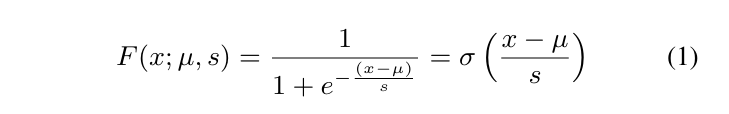
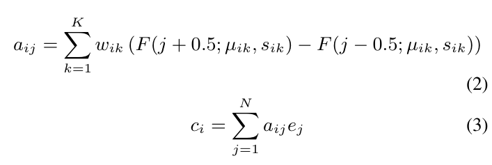
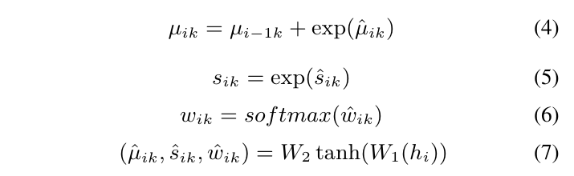
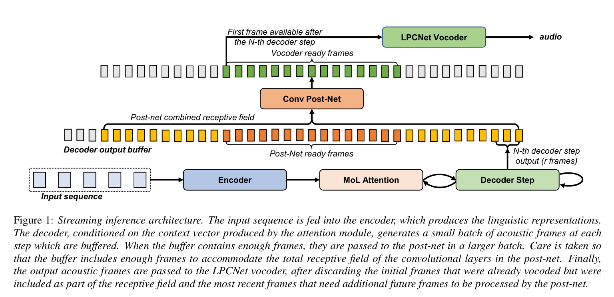

# High Quality Streaming Speech Synthesis with Low, Sentence-Length-Independent Latency
___
##  Abstract
本文介绍了一种适用于实时应用的低延迟端到端文本转语音系统，该系统在 CPU 上具有低延迟。该系统由基于自回归注意机制的序列到序列声学模型和用于波形生成的 LPCNet 声码器组成。提出了一种采用 Tacotron 1 和 2 模型模块的声学模型架构，同时通过使用最近提出的纯基于位置的注意机制来确保稳定性，适用于任意长度的句子生成。在推理过程中，解码器展开并以流式方式执行声学特征生成，允许几乎恒定的延迟，并且与句子长度无关。实验结果表明，声学模型可以生成特征序列，其最小延迟比计算机 CPU 上的实时速度快约 31 倍，比移动 CPU 上的实时速度快 6.5 倍，使其能够满足两种设备上实时应用所需的条件。完整的端到端系统可以生成几乎自然质量的语音，这已通过听力测试得到验证。

索引词：文本到语音合成、实时、序列到序列模型、流式推理、端到端 TTS
## 1. Introduction
近年来，深度学习研究和计算机硬件的发展已导致几乎所有语音处理应用都发生了范式转变。特别是对于文本转语音 (TTS)，已经从连接系统或基于 HMM 的统计参数模型转变为神经模型。后者产生了非常高质量的合成语音，同时大大简化了整个文本转语音流程。

在大多数情况下，语音合成管道由端到端声学模型（例如 Tacotron [1]）和声码器（例如 WaveNet [2] 或 WaveRNN [3]）组成。给定一系列语言特征，声学模型会以参数形式（例如梅尔频谱图）预测一系列语音帧。然后将声学特征序列输入到声码器中，以便以所需的采样率合成原始音频波形。在端到端声学模型的情况下，语言特征序列仅由字符序列或音素序列组成。此类模型通常具有非常多的参数，导致运行时复杂度很高。尽管它们的结果令人印象深刻且逼真，但对于需要在没有 GPU 的运行设备上进行实时语音合成的应用程序（例如手机、可穿戴设备和物联网设备）而言，这可能是令人望而却步的。

###  1.1. Related work
Tacotron 2 [4] 是最流行的声学模型，与 WaveNet 声码器结合使用时，可以产生几乎与人类水平相当的语音。它是一种基于注意力机制的序列到序列模型，利用了循环神经网络 (RNN) 和位置敏感注意力机制 [5]。为了摆脱复杂且训练缓慢的 RNN 的必要性，人们还提出了卷积模型，例如 Deep Voice 3 [6] 和 DCTTS [7]，以及基于用于机器翻译的原始架构的 Transformer [8] 模型 [9]。  

自回归模型的特点是推理速度慢，因为生成过程是按顺序进行的。总是有一个模型状态，必须将其传递到下一个时间步骤，以便模型能够生成声学帧。

ParaNet [10]、ClariNet [11] 和 GAN-TTS [12] 是完全卷积模型，它们试图摆脱上述模型的自回归性并并行合成语音。后两者分别使用知识蒸馏和对抗性训练实现了直接的文本到音频合成。FastSpeech [13] 是解决推理速度慢问题的最一致的尝试。它由一个前馈变压器网络组成，该网络能够并行生成声学帧，由长度调节器引导，该调节器产生每个语言单元与其相应数量的声学帧之间的对齐。

对于声码器，WaveNet[2] 是第一个在梅尔频谱图条件下产生高质量音频的自回归卷积模型。由于其逐个样本生成，它也是推理速度非常慢的一个例子，后来在 Parallel WaveNet [14] 中通过并行生成缓解了这一问题。WaveGlow [15] 是一种非自回归模型，它使用正则化流并产生最先进的结果，但在 CPU 上的推理速度很慢。最近两个使用对抗性训练的尝试是 MelGAN [16] 和 Parallel WaveGAN [17]。

据我们所知，之前的研究主要集中在不同的架构设计上，以便产生尽可能好的语音质量，利用强大的 GPU 进行训练和推理。神经声学模型在 CPU 上运行时的性能并没有受到太多关注，而 CPU 代表了一些实际应用的更现实场景。在声码器领域，WaveRNN [3] 和 LPCNet [18] 就是很好的例子，一个非常简单的架构（在这种情况下几乎只由几个 RNN 单元组成）如果设计得当，可以比实时更快地产生高质量的结果。
###  1.2. Proposed method
在本文中，我们重点关注优化声学模型，以适应实际的 CPU 应用。我们在[1, 4, 18, 19] 的先前工作的基础上做出了以下贡献：
* 具有最小延迟且与句子长度无关的纯自回归模型的流式推理方法
* 整体轻量级端到端 TTS 架构，复杂度低，在 CPU 上运行速度比实时更快
* 利用强大的对齐模型来消除注意力缺失错误
我们特别感兴趣的是具有最先进质量的 TTS 系统，该系统适用于低成本的移动设备和服务器端应用程序。对于此类应用程序，除了质量之外，在评估模型的可行性时还需要考虑其他变量。许多模型的一个重大障碍是推理时间取决于句子长度，这可能会导致速度大幅下降，尤其是现在通过新颖的对齐模型 [19] 可以生成非常长的句子。另一个瓶颈是从合成开始到生成可听语音的延迟。

所提出的声学模型与流式传输方法相结合，可以在单个 CPU 线程上以比实时快 31 倍的速度生成帧，同时将其延迟最小化到约 50 毫秒。在手机上，由于移动 CPU 的性能下降，这些数字分别变为 6.5 和 240 毫秒。在计算机 CPU 上，包括波形生成在内的完整合成比实时快约 7 倍，在移动设备上则快 2.7 倍。
##  2. Method
### 2.1. Acoustic model architecture
声学模型将输入序列映射到与 LPCNet 声码器使用的表示相对应的声学特征帧序列。它是一种基于注意的序列到序列模型，是 Tacotron 1 和 2 [1][4] 的直接修改。

编码器将输入序列 p = [p1 pN] 转换为可学习的嵌入向量，然后由 2 层预网络和来自 [1] 的 CBHG 堆栈处理，以生成最终编码器表示 e = [e1 eN]。在解码器端，输入是声音帧 f = [f1 fT]，再次由预网络处理。在每个解码步骤中，注意 RNN 通过使用与前一个注意上下文向量连接的前一步的输出来生成隐藏状态 hi。注意模块生成当前上下文向量，然后将其与注意 RNN 隐藏状态一起馈送到 2 个残差解码器 RNN 的堆栈中。

输出声学帧由单个全连接层预测。解码完成后，从 [4] 中的 5 层卷积后网络构建残差并将其添加到输出中，以提高最终输出的质量。与 Tacotron 2 类似，表示声学序列结束的二进制停止标记也是从具有 S 形激活的全连接层预测的。

### 2.2. Alignment model
在 [19] 中，对各种注意力机制进行了系统性比较，结果表明，Graves [20] 引入的纯基于位置的 GMMattention 能够推广到任意序列长度，并且不会违反学习对齐的单调性。它不依赖于编码器输出来计算分数，而是具有传递到下一步的状态，使其成为我们的流式模型的最佳候选者，以便与句子长度无关。

我们的模型使用了 GMM 注意力机制的变体，类似于 [21]，其中高斯分布的混合被逻辑分布的混合 (MoL) 所取代，因此我们将其称为 MoL 注意力机制。为了计算对齐，我们直接使用逻辑分布的累积分布函数 (1)，该函数的计算非常简单，因为它等于 S 型函数。

因此，对于每个解码器步骤 i，每个编码器时间步长 j 的对齐概率按 (2) 计算，上下文向量则为编码器表示的加权和 (3)。

混合参数在每个时间步计算，如公式 (4-6) 所示，根据中间参数 ik、sik、 wik 计算，这些参数由应用于注意 RNN 状态 hi 的 2 个完全连接层 (7) 预测。

###  2.3. Vocoder
我们使用 LPCNet [18] 声码器，该声码器通过 [22] 的并行工作进行了调整，以降低复杂度。通过线性预测系数 (LPC) 提供频谱包络的​​初始估计，该方法允许神经模型专注于对激励信号进行建模，从而使其能够以显着降低的复杂度产生最先进的语音质量。LPCNet 所需的调节参数被用作我们声学模型的目标，因此我们有一个端到端的语音合成管道。

### 2.4. Streaming inference
在语音生成过程中，必须生成声学帧序列，然后将其输入到声码器中。像 Fast Speech [13] 这样的模型可以生成整个序列，然后将其输入到 WaveGlow [15] 这样的声码器中，后者又可以生成完整的原始语音。由于内存高效的并行计算，这个过程在 GPU 上花费的时间非常少。然而，对于需要在 CPU 上合成的较长的语音，这个过程可能需要更长的时间，从而增加了从合成开始到生成最终可听语音的延迟。

图1：流式推理架构。输入序列被输入到编码器，编码器产生语言表征。解码器以注意力模块产生的上下文向量为条件，在每个步骤生成一小批声学帧，并进行缓冲。当缓冲区包含足够多的帧时，它们将以更大的批次传递到后网络。注意缓冲区包含足够的帧以容纳后网络中卷积层的总感受野。最后，输出声学帧在丢弃已经声码但作为感受野的一部分的初始帧和需要后网络处理其他未来帧的最新帧后，被传递到 LPCNet 声码器。

我们实现了一个流式推理过程，可以在声学模型的推理过程完成之前将声学帧输入声码器，如图 1 所示。LPCNet 声码器是自回归的，因此它可以在接收到第一个声学帧后开始生成，而且由于它的运行速度比实时速度快，因此几乎可以立即听到生成的音频。

为了最大限度地减少延迟，我们利用其卷积特性，不断收集声学帧，并将其并行传递给后网络。后网络经过训练以完善完整的声学帧序列，但由于它是完全卷积的，因此它也可以以较小的序列执行相同的过程。每个解码器步骤的输出帧都会累积在缓冲区中，然后以较大的块形式发送到后网络。应保留要合成的帧段前后的一小段帧窗口，并将其馈送到后网络，该窗口由卷积层的总感受野（在我们的模型中为 21 个）决定，以使输出与模型的非流式版本相同。发送到后网络的每个块中的帧数是系统延迟和实时因子 (RTF) 之间的权衡。如果它很小，则延迟也很小，因为可用于声码器的第一帧需要几个解码器步骤，但窗口帧的计算开销很大，阻碍了实时因素。另一方面，如果为后网络处理累积的帧数太大，窗口帧开销会减少，但延迟会增加，因为我们需要等待更多的解码器步骤。对于发送到后网络的块，选择 100 帧的值，该块对应于 1 秒的语音，因为通常的做法是在播放之前缓冲一定量的音频以避免静态，特别是如果音频通过网络传输。然后，声码器从后网络的输出合成前 1 秒的音频。合成第一秒的音频后，用户可以在生成下一个音频段时开始收听。图 1 中可以看到所提出方法的详细可视化。

该方法在生产环境中可行的唯一要求是 CPU 能够以比实时更快的速度运行该过程。这样，无论句子长度如何，都可以保证低且稳定的延迟。在我们的实验中，我们发现基于 CBHG 的后网络架构也是可行的，尽管由于双向 GRU 层，最终输出与非流式版本不完全相同，但如果窗口调整得当，质量不会受到显着影响。

