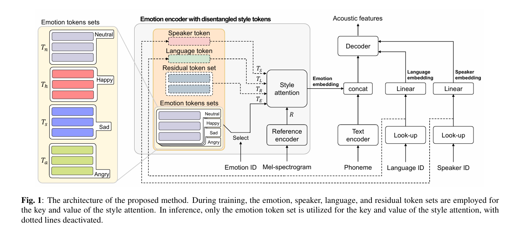
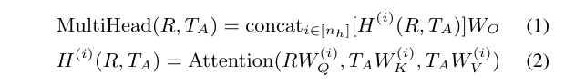

# Mels-Tts : Multi-Emotion Multi-Lingual Multi-Speaker Text-To-Speech System Via Disentangled Style Tokens
___
## ABSTRACT
本文提出了一种多情感、多语言和多说话人的文本转语音 (MELS-TTS) 系统，采用解开的风格标记来实现有效的情感传递。在包含各种属性（例如情绪状态、说话者身份和语言风格）的语音中，解开这些元素对于高效的多情感、多语言和多说话人的 TTS 系统至关重要。为了实现这一目的，我们建议利用单独的风格标记来解开情感、语言、说话者和残留信息，这受到全局风格标记 (GST) 的启发。通过注意机制，每个风格标记从目标语音中学习其各自的语音属性。我们提出的方法在客观和主观评价中都提高了性能，展示了能够生成具有多种情感的跨语言语音的能力，即使是来自中性的源说话者，同时保留说话者的身份。  
索引词——语音合成、情感语音合成、情感传递、跨语言语音合成
##  1. INTRODUCTION
随着神经文本转语音 (TTS) 系统 [1–5] 成功生成类似人类的语音，对多情感或多语言 TTS 系统的需求正在增加。在现实世界中，要求目标说话者以多种情感或语言讲话是一项挑战。先前的研究 [6–10] 探索了情感 TTS 系统，特别关注将情感从多情感源说话者转移到中性目标说话者。此外，一些研究调查了跨语言 TTS，旨在生成各种语言的语音，同时保留目标说话者的身份 [11–13]。  
情感传递或跨语言 TTS 系统从源说话者那里学习情感或语言信息，并将其传递给目标说话者。由于内容、说话者身份、情感、语言和说话风格等语音属性固有的交织，这个过程非常复杂。正确分离这些属性对于将所需的语音属性正确地传递给目标说话者至关重要。当这些语音属性带有适当的标签时，解开它们变得更加简单 [14, 15]。在这些语音属性中，情感在不同语音中表现出明显的复杂性和多变性。我们的初步实验表明，基于标签的 TTS 难以处理看不见的标签组合，尤其是在跨语言情况下合成情感语音。  
为了克服这些解开难题，人们探索了基于参考的 TTS 系统 [16–21]。在 [19] 中，情感信息以无监督的方式从参考语音中提取出来。尽管如此，通过基于参考的 TTS 系统 [9,21] 确保从参考语音中独家分离和提取情感信息仍然具有挑战性。为了解决这一限制，之前的几项研究提出利用辅助分类器 [22] 或对抗性分类器 [11,13] 来指导嵌入向量学习预期信息。虽然类似的方法已应用于基于参考的 TTS 系统 [9]，但目前仅限于单语场景。最近的一项研究 [10] 提出最小化情感、语言和说话人身份属性之间的相互信息，以解决跨语言场景。  
在我们的实证观察中，我们注意到话语中语音属性的强度存在变化。例如，某些话语可能会突出强调说话者的身份，但缺乏情感表达。因此，当语音中没有清楚地传达预期信息时，通过基于参考的系统从参考语音中提取预期信息就成为一项具有挑战性的任务。这种限制严重阻碍了准确提取预期信息，尤其是当不同语音属性的强度在单个话语中波动时。  
为了解决基于参考的 TTS 系统中的解缠结挑战，我们提出了一种有效的多情感、多语言和多说话人 TTS (MELS-TTS) 系统。在 MELS-TTS 系统中，情感编码器的设计受到全局风格标记 (GST) 系统 [16] 的启发，GST 系统是一种著名的基于参考的风格控制 TTS 系统。我们采用 GST 的方法来学习目标语音中风格标记和参考嵌入的相似性。为了提高 MELS-TTS 系统的解缠结能力，我们提出了一种带有解缠结风格标记的情感编码器，即四种不同的风格标记：说话人、语言、残差和情感。这些标记被明确指定为表示相应的语音属性。在训练阶段，MELS-TTS 系统通过注意力机制学习每个解缠结风格标记对目标语音的影响。这样，通过单独学习各种语音属性的影响，就可以成功解开它们。
在推理阶段，我们从解开的风格标记中选择性地选择所需的情感标记。这些标记用于通过注意力从所需的参考嵌入中提取情感嵌入，从而促进我们系统中强大的情感传递。客观和主观评价都证实，我们的 MELS-TTS 系统在多语言和多说话者场景中的情感传递方面优于其他基于参考的 TTS 系统。  
  
##  2. PROPOSED METHOD
###  2.1. Overall architecture
我们提出的方法 MELS-TTS 1 基于 Tacotron 变体 [23]，如图 1 所示。文本编码器将音素序列处理为文本嵌入，解码器使用该嵌入自回归生成声学特征。在每个解码器步骤中，预网络处理目标声学特征的前一帧，这些特征在推理过程中被预测。预网络输出与之前的注意上下文连接在一起，产生当前上下文向量。这驱动了解码器 RNN 堆栈，预测目标声学特征和停止标记。  
MELS-TTS 的主要区别在于对情感、说话者和语言信息的处理。从情感编码器中提取的情感嵌入具有解开的风格标记，并与文本嵌入连接。说话者和语言 ID 通过查找表进行处理，有助于解开风格标记。经过线性层后，说话者和语言嵌入与解码器的预网络输出连接，提供对说话者和语言的控制。总体而言，所提出方法的训练目标与 Tacotron 变体 [23] 相同，没有额外的损失。  
###  2.2. Emotion encoder with disentangled style tokens
我们采用了 [16] 中描述的参考编码器和风格注意机制。参考编码器将目标语音的梅尔频谱图处理成参考嵌入，作为风格注意机制的查询。对于风格注意机制的键和值，我们提出了代表四种语音属性的解耦风格标记：说话者、语言、情感和残差。  
#### 2.2.1. Disentangled style tokens
情感标记集 情感标记集被配置为仅从参考嵌入中学习情感信息。我们为每种情感组织情感标记集，以确保平衡学习，以解决不平衡的情感数据库。每个情感标记集都包含一组随机初始化的嵌入，以捕捉情感类别中的各种细微差别。使用情感 ID，根据目标梅尔频谱图的情感选择相应的标记集。  
说话者标记 我们设计说话者标记来辅助情感嵌入，确保说话者信息与参考嵌入分离。在训练期间，说话者标记用于从参考嵌入中学习说话者信息，利用说话者查找表中的输出嵌入。通过在推理过程中从解开的风格标记中排除说话者标记，我们可以从参考嵌入中提取情感嵌入，而无需合并说话者信息。  
语言标记 语言标记的功能与说话者标记类似，旨在将语言细节与参考嵌入分开。语言标记利用语言查找表输出进行训练，但在推理中被省略。 
残差标记集 除了说话者和语言属性之外，我们还承认非情感信息中还存在其他细节，称为残差信息。为了适应这种多样性，残差标记集包含随机初始化的嵌入。与说话者和语言标记类似，它在推理过程中被排除，以将残差信息与参考嵌入分开。  
####  2.2.2. Style attention
训练为了从参考嵌入 R ∈ R1× dR 中捕获不同的语音信息，我们使用所有解开的风格标记 TA ∈ RNA× dT 作为风格注意机制中的键和值。这些标记包括选定的目标情感标记集 TE ∈ RNE× dT、说话人标记 TS ∈ RNS× dT、语言标记 TL ∈ RNL× dT 和残差标记集 TR ∈ RNR× dT。TE 是从情感标记集中选择的，其组成可能根据训练数据中情感的多样性而变化。在我们的实验中，我们使用四个情感标记集 {Tn,Th,Ts,Ta}，分别代表中性、快乐、悲伤和愤怒的情感标记集。NE、NS、NL 和 NR 表示情感标记集、说话人标记、语言标记和残差标记集中标记的数量，它们的总和等于 NA。对于风格注意力机制，我们采用具有 n 个头的多头注意力机制 [24]，如下所示：  
  
其中 Attention(Q,K,V ) = softmax(QKT/√dk)V，dk是每个头部的维度。投影参数 W(i)Q ,W(i)和 W(i)K , V 是针对第 i 个头部进行学习的，WO 将所有头部的注意力输出串联起来投影到情感嵌入上。  
推理对于特定于情绪的显着性，我们停用说话者、语言和残差标记集。我们使用选定的情绪标记集 TE 作为等式 (1) 和 (2) 中风格注意的键和值，而不是 TA。  
### 2.3. Inference of MELS-TTS
为了合成跨情绪的语音，我们首先确定每个情绪的代表性情绪嵌入以进行推理。如第 2.2.2 节所述，我们从情绪标记集中选择所需的情绪标记集。接下来，我们计算所有训练数据库话语的情绪嵌入，并获取每种情绪的平均情绪嵌入。最接近该平均值的话语的情绪嵌入充当代表性情绪嵌入。从经验上讲，使用现有话语的情绪嵌入优于使用平均情绪嵌入。有了代表性情绪嵌入，推理过程中就不需要参考语音了，我们可以稳定地合成具有所需情绪的语音。所需的代表性情绪嵌入与文本编码器的输出连接在一起，所需的说话者和语言 ID 通过查找表和线性层进行处理，然后输入解码器。  

