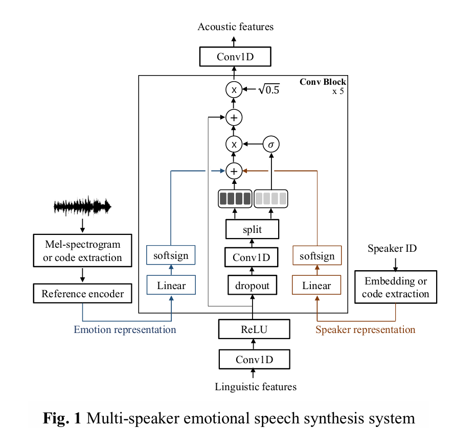
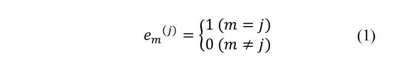
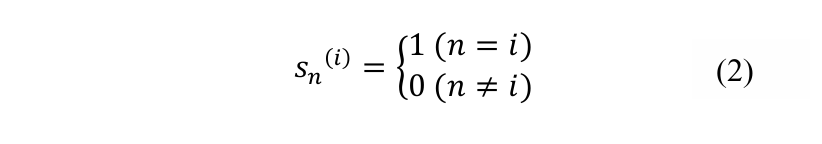

# Multi-speaker Emotional Acoustic Modeling for CNN-based Speech Synthesis
___
## ABSTRACT
在本文中，我们研究了基于卷积神经网络 (CNN) 的语音合成系统的多说话人情感声学建模方法。对于情感建模，我们扩展到语音合成系统，该系统学习从期望的情感身份中得出的情感潜在嵌入空间，并使用情感代码和梅尔频谱图作为情感身份。为了在文本到语音 (TTS) 系统中对说话人变化进行建模，我们使用说话人表示，例如可训练的说话人嵌入和说话人代码。我们已经实现了结合说话人表示和情感表示的语音合成系统，并通过实验对它们进行了比较。实验结果表明，与其他方法相比，使用可训练的说话人嵌入和梅尔频谱图中的情感表示的多说话人情感语音合成方法在自然度、说话人相似性和情感相似性方面取得了更高的性能。  
索引词——文本转语音、富有表现力的语音合成、多说话人声学建模、卷积神经网络
## 1. INTRODUCTION
深度神经网络（DNN）已广泛应用于各种语音处理任务，包括语音合成[1, 2]。目前，人机交互对提高语音合成系统的灵活性和可控性的需求日益增加。  
关于说话人变异性，Fan 等人 [3] 提出了一种基于 DNN 的多任务学习方法，用于具有说话人特定输出的多说话人建模，而 Pascual 等人 [4] 采用了类似的方法，即使用循环神经网络 (RNN)-长短期记忆 (LSTM) 架构 [5]。Hojo 等人 [6] 介绍了说话人代码的使用，Zhao 等人 [7] 比较了将说话人身份向量（即 i 向量和说话人代码）输入输入层的性能。此外，Li 等人 [8] 提出了多语言多说话人文本转语音 (TTS) 系统。 受控制说话人变异性的启发，人们研究了情绪控制技术。An 等人 [9] 提出了一种通过在模型的每一层添加情绪代码来重新训练中性神经网络模型的方法。Inoue 等人[10] 研究了如何同时控制说话人的变化和情绪的变化。  
最近，Skerry-Ryan 等人 [11] 展示了通过直接从声学信号（即梅尔频谱图）中学习到的韵律表示进行韵律迁移。他们表明，对学习到的嵌入进行调节 Tacotron [12] 会产生与参考信号韵律相匹配的合成音频，即使参考和合成说话者不同。预测的梅尔频谱图 [13] 通过 WaveNet 声码器 [14] 合成，以提高音频保真度。  
与之前的研究类似，我们采用了类似的方法，包括对说话者身份进行建模，我们利用参考编码器 [11] 增强了语音合成系统，该编码器从情感身份中提取固定长度的学习表征，并重现所需说话者的情感语音音频。在这项工作中，我们对不同说话者表征和情感表征的可控性进行了比较研究。此外，我们使用 WaveNet 声码器从预测的梅尔频谱图中合成语音信号，并评估其质量、自然度和相似度方面的性能。  
## 2. MULTI SPEAKER EMOTIONAL SPEECH SYNTHESIS
多说话人情感语音合成系统的整体架构如图 1 所示。在基于卷积神经网络 (CNN) 的语音合成系统中，CNN 将语言特征作为输入，将声学特征（梅尔频谱图）作为输出，并学习语言和声学空间之间的映射。为了获取较长的上下文信息，我们使用扩张卷积网络 [24] 代替循环神经网络 (RNN)。与 [15] 类似，卷积块由一维卷积、作为可学习非线性的门控线性单元 [25] 和与输入的残差连接组成。在软符号函数之后，将与信号的真实说话人相对应的说话人表示作为偏差添加到卷积滤波器输出中。为了明确控制情绪，我们添加了参考编码器模块来学习情绪的潜在表示。与说话者表征一样，情感表征也应用于整个卷积层。  
  
### 2.1. Emotion representation modeling
我们通过添加参考编码器模块 [11] 来扩展 CNN 架构，该模块以情绪身份为输入并从中提取固定长度的嵌入。在推理过程中，我们可以使用参考编码器对任何所需的情绪梅尔频谱图序列或情绪代码进行编码。 对于参考编码器架构，我们使用 6 层 2-D 卷积网络，每层中的滤波器数量分别为 32、32、64、64、128 和 128。每层由 3 x 3 个滤波器组成，步幅为 2 x 2，填充相同，并采用 ReLU 激活。批量归一化 [16] 应用于每一层。 最终卷积层的输出被传递到包含 128 个单元的单个门控循环单元 (GRU) [17] 层，然后进行 tanh 激活。  
给定一个情绪身份，参考编码器会检索相应的情绪表征，并且该表征会在整个 CNN 架构中使用。  
### 2.1.1. Emotion estimation from mel spectrogram
梅尔频谱图 [13] 不仅包含语言信息，还包含韵律等非语言信息。由于韵律包含情感信息，因此梅尔频谱图可用作情感标识。因此，本文研究了利用参考编码器从梅尔频谱图序列中估计情感表示的方法。  
### 2.1.2. Emotion estimation from emotion code
情感代码在情感语音合成中取得了令人鼓舞的效果[9,10]。如[10]所述，如果有M种情感的语料库用于模型训练，则第j种情感的情感代码𝐸(𝑗)定义为𝐸(𝑗)=(𝑒1(𝑗),𝑒2(𝑗),…,𝑒𝑀(𝑗))，其中每个值𝑒𝑚(𝑗)表示如下。
  
### 2.2. Speaker representation modeling
通过对说话人表征进行条件反射来学习多说话人模型非常简单。为了使用多个说话人合成语音，我们描述了与 [15] 中介绍的类似的可训练说话人嵌入方法，以及说话人编码方法[6,7,11]
#### 2.2.1 Speaker embedding
我们为每个说话者添加一个低维说话者嵌入向量来增强我们的声学模型。说话者嵌入的权重从均值为 0、标准差为 0.01 的正态分布中随机初始化。说话者嵌入与模型联合训练，因此隐藏层在所有说话者类型之间共享。第 i 个说话者表示 𝑆𝐸(𝑖) 是说话者索引 i 的对应嵌入向量。  
#### 2.2.2 Speaker code 
为了控制说话人，基于神经网络的说话人编码方法已被证明是一种有效的多说话人建模方法。如第 2.1.2 节所述，我们可以简单地使用 𝑆(𝑖) = (𝑠1(𝑖),𝑠2(𝑖),…,𝑠𝑁(𝑖)) 来表示第 i 个说话人代码，每个 𝑠𝑛(𝑖) 定义如下。  
