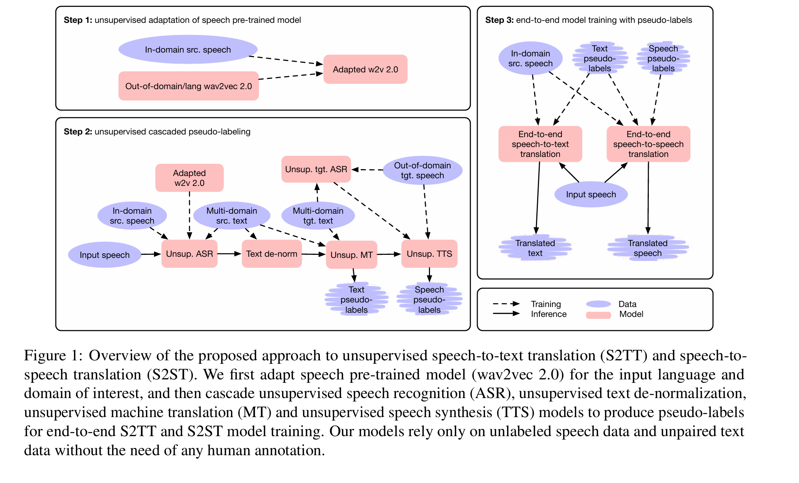
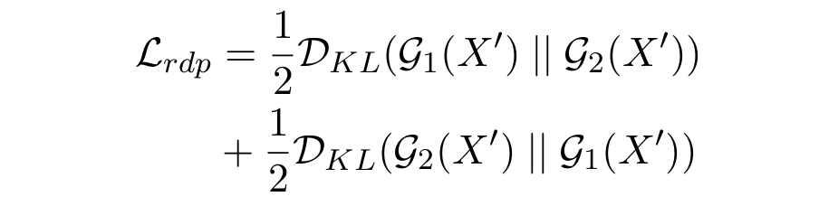
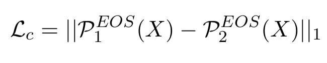

## Simple and Effective Unsupervised Speech Translation
____
### Abstract
对于大多数语言来说，用于训练语音任务模型的标记数据量是有限的，然而，语音翻译需要涵盖两种不同语言的标记数据，数据稀缺性更加严重。为了解决这个问题，我们研究了一种简单有效的方法，利用无监督语音识别、机器翻译和语音合成方面的最新进展，以流水线方式构建无需标记数据的语音翻译系统，或生成伪标签来训练端到端语音翻译模型。此外，我们提出了一种用于预训练语音模型的无监督领域自适应技术，该技术可提高下游无监督语音识别的性能，尤其是在资源匮乏的环境中。实验表明，在 Libri Trans 基准上，无监督语音转文本翻译比之前的无监督翻译高出 3.2 BLEU；在 CoVoST 2 上，我们的最佳系统比仅仅两年前最好的监督端到端模型（无需预训练）高出平均 5.0 BLEU（在五个 X-En 方向上）。我们还报告了在 MuST-C 和 CVSS 基准上的有竞争力的结果。
###  1 Introduction
训练监督语音系统需要大量标记数据，而这些数据通常并非适用于全世界 7,000 多种语言中的一小部分（Lewis 等人，2022 年）。尽管最近在创建语音翻译语料库方面付出了很多努力（Di Gangi 等人，2019a；Wang 等人，2021b），但仅涵盖了几十个语言方向。语音翻译缺乏标记训练数据的问题更为严重，因为它需要两种语言中对齐的标记数据，这增加了创建此类数据集的工作量。这就提出了一个问题：是否可以使用更少的标记数据或根本不使用标记数据来构建语音翻译系统。

无监督语音识别的最新研究已取得一定成果，可实现不使用标记数据的有用系统（Yeh 等人，2019 年;Liu 等人，2018 年；Chen 等人，2019 年；Baevski 等人，2021 年；Liu 等人，2022a 年），这在很大程度上得益于自监督语音表示学习的进步（Schneider 等人，2019 年；Baevski等人，2020 年）。这些技术还用于构建无监督文本转语音系统（Liu等人，2022b 年）。同样，无监督的文本到文本机器翻译在某些语言方向上显示出巨大的前景（Conneau 等人，2018 年；Lample 等人，2018年；Artetxe 等人，2018 年）。

在本文中，我们研究了一种构建端到端无监督语音到文本和语音到语音翻译系统的方法，该系统在通过级联现有的无监督技术获得的合成训练数据上进行训练：我们首先使用无监督语音识别转录源语言中的语音话语（Baevski 等人，2021；刘等人，2022a），然后使用无监督机器翻译翻译生成的转录（Lample 等人，2018；Artetxe 等人，2018；刘等人，2020），最后使用无监督语音合成将翻译合成为目标语言语音话语（刘等人，2022b）。我们还考虑在推理时直接应用管道。我们的方法受益于使用自监督语音模型（Baevski 等人，2020 年；刘等人，2020 年），并且为了进一步提高性能，我们提出了一种将现有的自监督模型适应目标领域的技术。

###  2 Background
无监督语音识别。Liu 等人 (2018) 介绍了一些最早的无监督音素识别研究，他们的研究应用了对抗性训练。Wav2vec-U (Baevski 等人，2021) 有效地应用了自监督语音表示，引入了新的评估指标，并与在大量标记数据上训练的最先进的监督系统进行了比较。Wav2vec-U2.0 (Liu 等人，2022a) 通过更好的架构和更好的训练目标简化了音频端预处理并提高了准确性。Lin 等人 (2022) 表明，域外语音预训练或域外文本数据会损害 Wav2vec-U 模型的训练鲁棒性，尤其是在资源匮乏的环境下。

图 1：所提出的无监督语音到文本翻译 (S2TT) 和语音到语音翻译 (S2ST) 方法概述。我们首先针对输入语言和感兴趣的领域调整语音预训练模型 (wav2vec 2.0)，然后级联无监督语音识别 (ASR)、无监督文本反规范化、无监督机器翻译 (MT) 和无监督语音合成 (TTS) 模型，以生成用于端到端 S2TT 和 S2ST 模型训练的伪标签。我们的模型仅依赖未标记的语音数据和未配对的文本数据，而无需任何人工注释。

无监督语音合成。最近的研究表明，无监督语音合成系统能够实现与监督系统相当的性能（Liu 等人，2022b；Ni 等人，2022）。这些系统使用无监督语音识别模型标记语音音频数据，并在生成的模型上训练文本转语音模型，从而对数据进行训练。

无监督机器翻译。Lample 等人 (2018) 和 Artetxe 等人 (2018) 通过利用多语言序列到序列模型中表示的跨语言相似性以及反向翻译来进一步完善初始模型，构建了第一个完全无监督的机器翻译 (MT) 系统。mBART (Liu 等人，2020) 使用类似的模型架构和训练过程来构建无监督 MT 模型，但它利用了更大规模的多语言文本语料库 (Conneau 等人，2020) 和更新的噪声策略进行预训练，并使用去噪自动编码器目标。

端到端语音翻译。端到端序列到序列建模在语音到文本翻译（Duong 等人，2016 年；Bérard 等人，2016 年；Weiss 等人，2017 年；Bansal 等人，2017 年；Vila 等人，2018 年；Di Gangi 等人，2019b 年；Ren 等人，2020 年；Li 等人，2021 年）和语音到语音翻译（Jia 等人，2019 年；Kano 等人，2021 年；Jia 等人，2022a 年）中的应用日益增多。与级联系统相比，端到端语音翻译模型具有更简单的管道和更低的推理延迟。结果表明，最近的端到端语音到文本翻译 (S2TT) 模型在成熟的 MuST-C 基准 (Bentivogli 等人，2021) 上的表现与级联模型相当。鉴于语音翻译语料库的稀缺性，最近有人尝试在低资源设置 (Bansal 等人，2018、2019；Cheng 等人，2021) 或无监督设置 (Chung 等人，2019) 下构建端到端 S2TT 模型。

### 3 Methods
图 1 概述了我们提出的无监督语音到文本翻译 (S2TT) 和语音到语音翻译 (S2ST) 方法。我们利用一系列无监督模型来为端到端 S2TT 和 S2ST 模型训练生成伪标签。为了缓解语音预训练 (wav2vec 2.0) 中的语言和领域不匹配问题，我们使用未标记的域内语音数据对 wav2vec 2.0 模型进行微调，然后使用经过调整的模型构建下游语音识别模型。

####  3.1 Unsupervised Cascaded Pseudo-Labeling
我们级联无监督语音识别 (ASR)、无监督文本反规范化 (TDN) 和无监督机器翻译 (MT) 模型来为 S2TT 生成伪标签。对于 S2ST，我们还将无监督语音合成 (TTS) 模型应用于 MT 模型输出以获得合成的目标语音。

无监督 ASR。我们采用 wav2vec-U 2.0（Liu et al.，2022a），它通过对抗训练学习从自监督语音表示到音素的映射，并通过加权有限状态转换器将音素解码为单词（Mohri，1997）。为了提高对抗训练的稳定性并抑制低资源设置下的过度拟合，我们在冻结的输入特征 X 中添加了高斯噪声

以及 R-Drop 正则化 (Wu et al., 2021)到生成器的 logit 输出

其中 G1 和 G2 是具有不同 dropout mask 的两个生成器实例，DKL 是 KullbackLeibler (KL) 散度。我们将加权 αLrdp 添加到 wav2vec-U 2.0 目标函数中，其中 α是超参数。在对抗学习之后，我们遵循 Baevski 等人 (2021) 使用隐马尔可夫模型 (HMM) 进行自我训练，然后再次使用 HMM 标签上的 CTC 目标对调整后的 wav2vec 2.0 模型进行微调。我们将最终的 ASR 模型表示为“w2vu2-CTC”。

无监督机器翻译。我们采用 mBART (Liu 等人，2020)，它具有 Transformer 架构 (Vaswani 等人，2017)，其模型参数在所有训练语言之间共享。它首先通过去噪自动编码器目标 (Vincent 等人，2010) 获得所有语言的初始跨语言对齐，然后通过对该语言对进行双向在线反向翻译来细化特定语言对的对齐。我们将此模型表示为“mBART-OBT”。

无监督 TDN。ASR 模型解码规范化的口语形式文本，这些文本没有大小写或标点符号（连字符和撇号除外）。然而，MT 模型对具有大小写和标点符号的非规范化书面形式文本进行编码。当我们直接将两个模型级联进行伪标记时，这种差异会导致质量下降。为了减轻不匹配，我们将 ASR 模型输出反规范化为非规范化的书面形式，然后再将它们输入到 MT 模型中。文本反规范化器是一个 mBART 模型，使用去噪自动编码器目标进行预训练，并使用原始文本（输出）及其规范化版本（输入）的配对数据进行微调。

无监督 TTS。我们遵循 Liu 等人（2022b）的方法，使用 wav2vec-U 2.0 为未标记语音数据生成音素标签，然后在伪标记数据上训练自回归 Transformer TTS 模型（Li 等人，2019 年）。对于 wav2vec-U 2.0，我们执行基于 HMM 的自我训练，并使用 HMM 音素标签对预训练的 wav2vec 2.0 模型进行微调。为了缓解自回归模型中的欠生成和过度生成问题，我们添加了 R-Drop 样式一致性损失

到目标函数（由超参数 α 加权）以获得更好的句末 (EOS) 预测，其中 PEOS 1 和 PEOS 2 是针对同一输入 X 具有不同 dropout mask 的两个 EOS 预测。

####  3.2 Unsupervised Adaptation of wav2vec 2.0Pre-trained Models
接下来，我们提出一种在用于自监督预训练的数据域与下游任务域不同（低资源语言通常如此）时提高性能的方法。具体来说，我们通过使用 CTCobjective（Graves 等人，2006 年）从未标记的域内数据中获得的离散标签对整个 wav2vec 2.0 模型进行微调，将域外或语言外的 wav2vec 2.0 模型调整为感兴趣的域和语言。

为了获得离散标签，我们首先收集所有 wav2vec 2.0 语音表示作为训练数据，并执行 k 均值聚类以识别 K 个聚类。然后，对于每个话语，我们用相应的聚类 ID yt ∈ {1,...,K} 标记其每个 T 个语音表示帧 xt，其中 t ∈ {1,...,T}。最后，我们合并相同的连续 yt 以获得最终标签 y′ t′ ，其中 t′ ∈ {1,...,T′} 且 T′ ≤ T。

在使用离散标签进行无监督微调后，我们丢弃了用于 CTC 目标的输出投影层，并在下游任务中使用生成的 wav2vec 2.0 主干代替原始 wav2vec 2.0 模型。调整后的模型用于提取 wav2vec U2.0 模型的语音表示，以及 wav2vec-U 自训练中 CTC 模型的预训练编码器。

####  3.3 End-to-end Model Training with Pseudo-labels
从无监督模型的级联中获得伪标签后，我们在这些伪标签上训练端到端 S2TT 和具有监督目标的 S2TT 模型。对于端到端 S2TT，我们采用 Li 等人 (2021) 中的模型架构，我们将其表示为“w2v2-mBART”。我们通过无监督 ASR 模型 w2vu2-CTC 对其编码器进行预训练，并通过无监督 MT 模型 mBART-OBT 对其解码器进行预训练。对于端到端 S2ST，我们采用了 Translatotron 2 (Jia et al., 2022a) 的一个变体，Translatotron2+ (Inaguma et al., 2022)，它在 Translatotron 2 的两个解码器之间有一个额外的编码器，并用自回归 Transformer 解码器 (Li et al., 2019) 替换了 Translatotron 2 的第二个解码器。与 w2v2-mBART 类似，我们分别通过 w2vu2-CTC 和 mBART-OBT 对 Translatotron2+ 的第一个编码器和第一个解码器进行预训练。