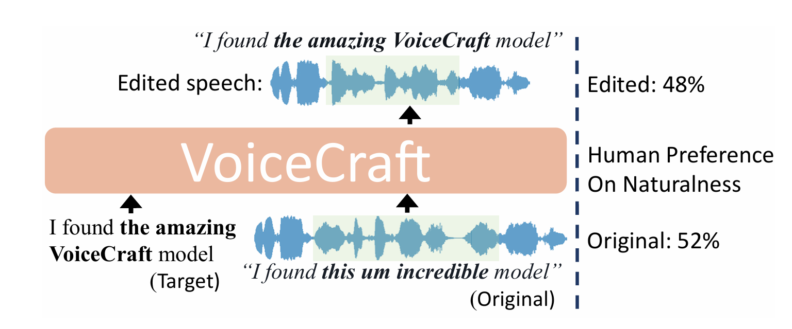
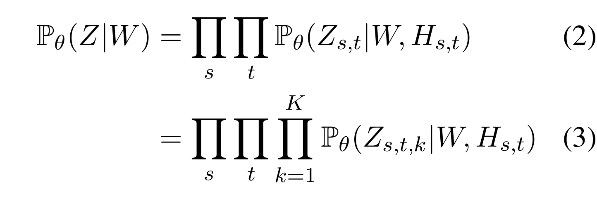
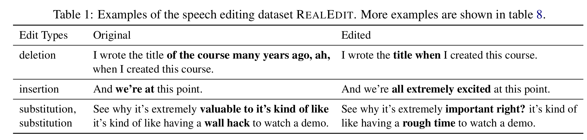

## VoiceCraft: Zero-Shot Speech Editing and Text-to-Speech in the Wild
___
###  Abstract
我们引入了 VOICECRAFT，这是一种标记填充神经编解码器语言模型，它在有声读物、互联网视频和播客 1 上的语音编辑和零样本文本转语音 (TTS) 方面均实现了最先进的性能。VOICECRAFT 采用 Transformer 解码器架构，并引入了一种标记重排程序，该程序结合了因果掩蔽和延迟堆叠，以便在现有序列内生成。在语音编辑任务中，VOICECRAFT 生成的编辑语音在自然度方面几乎与未编辑的录音没有区别，这是人类评估的；对于零样本 TTS，我们的模型优于之前的 SotA 模型，包括 VALL E 和流行的商业模型 XTTS v2。至关重要的是，这些模型是在具有挑战性和现实的数据集上进行评估的，这些数据集由不同的口音、说话风格、录音条件以及背景噪音和音乐组成，与其他模型和真实录音相比，我们的模型表现始终良好。特别是，对于语音编辑评估，我们引入了一个高质量、具有挑战性和现实的数据集，名为 REALEDIT。我们鼓励读者在 https://jasonppy.github.io/VoiceCraft_web 上收听演示。
###  1 Introduction
我们引入了 VOICECRAFT，这是一种基于 Transformer 的神经编解码器语言模型 (NCLM)，它以双向上下文为条件，对神经语音编解码器进行填充生成，以自回归的方式将标记赋值给标记。VOICECRAFT 在语音编辑（如图 1 所示）和零样本 TTS 上都实现了最先进的 (SotA) 性能。我们的方法基于两步标记重排程序，该程序由因果掩蔽步骤和延迟堆叠步骤组成。因果掩蔽技术受到因果掩蔽多模态的成功启发

图 1：使用 VOICECRAFT 编辑语音。在并排自然度比较中，人类听众 48% 的时间更喜欢 VOICECRAFT 编辑的语音，而不是原始真实录音（详情见§5.3）

为了评估语音编辑，我们手动制作了一个名为 REALEDIT 的首创、逼真且具有挑战性的数据集。REALEDIT 包含 310 个现实世界的语音编辑示例，波形来自有声读物 (Zen et al., 2019)、YouTube 视频 (Chen et al., 2021a) 和 Spotify 播客 (Clifton et al., 2020)，持续时间从 5 秒到 12 秒不等。为了创建目标成绩单，源语音的成绩单经过编辑，编辑后的成绩单保持语法正确且语义连贯。该数据集旨在涵盖广泛的编辑场景，包括插入、删除、替换和多跨度编辑，编辑文本的长度从 1 个单词到 16 个单词不等。与 VCTK (Yamagishi 等，2019)、LJSpeech (Ito and Johnson，2017) 和 LibriTTS (Zen 等，2019) 等常用的仅包含有声读物的语音合成评估数据集相比，REALEDIT 更具挑战性，因为录音具有多样化的内容、口音、说话风格、录音条件和背景声音。我们相信，REALEDIT 的真实性和多样性使其成为现实世界中语音编辑模型实用性的可靠指标。

在主观人类听力测试中，VOICECRAFT 在 REALEDIT 上的表现明显优于之前的 SotA 语音编辑模型。重要的是，VOICECRAFT 生成的编辑语音在自然度方面与原始未编辑的录音几乎没有区别。我们发现 VOICECRAFT 可以很好地推广到零样本 TTS，而无需任何微调，在由有声读物和 YouTube 视频组成的数据集上实现了 SotA 性能，优于包括复制的 VALL-E（Wang 等人，2023a）和流行的商业模型 XTTS v2（COQUI，2023）在内的强大基线。总之，我们的贡献是：

1. 我们推出了 VOICECRAFT，这是一种用于语音编辑的神经编解码器语言模型，它生成的合成语音与人类听众认为的自然录音几乎没有区别。我们还发布了 VOICECRAFT 的代码和模型权重。

2. 我们证明了 VOICECRAFT 能够很好地推广到零样本 TTS，无需微调。

3. 我们发布了高质量、具有挑战性且真实的语音编辑评估数据集REALEDIT。

### 2 Related Work
神经编解码器语言模型 (NCLM) 和零样本 TTS。将语音信号标记为可学习的离散单元序列，然后在得到的单元序列上训练语言模型，最初是在无文本 NLP 的背景下提出的 (Hsu 等人，2021 年；Lakhotia 等人，2021 年；Kharitonov 等人，2021b 年；Nguyen 等人，2022 年)，其目标是直接对口头话语执行 NLP 任务，而无需先将语音转录为文本。最近，对基于残差向量量化 (RVQ) 的模型 (Zeghidour 等人，2021 年；Defossez 等人，2022 年) 的标记进行操作的 NCLM 因其高质量的生成而受到越来越多的关注。例如，AudioLM (Borsos et al., 2022a) 在长期连贯语音延续方面表现出色。零样本 TTS 是一项任务，其中模型需要合成训练期间未见过的目标语音中的语音，仅给出目标语音的简短参考录音。将零样本 TTS 定义为转录条件语音延续，VALLE (Wang et al., 2023a) 和 Spear-TTS (Kharitonovet al., 2023) 是 NCLM 在该任务上的首次应用，其表现明显优于非 NCLM 方法。Zhang et al. (2023) 将 VALL-E 扩展到跨语言 TTS。Guo et al. (2022); Yang et al. (2023); Liu et al. (2023); Ji et al. (2023); Lyth 和 King (2024) 改编了 NCLM 风格控制的语音合成。Song 等人 (2024)；Du 等人 (2024b) 增强了 NCLM 中的音素对齐以减少错误。Wang 等人 (2023b) 提出了一种用于语音生成和识别任务的统一 NCLM。Borsos 等人 (2023) 提出了一种有效的并行解码方法。Jiang 等人 (2024) 提出了解开音色和韵律建模的方法，其中后者使用 NCLM 进行建模。NCLM 也已成功应用于其他音频领域。Kreuk 等人 (2022) 将 NCLM 应用于音效生成，Agostinelli 等人 (2023)；Donahue 等人 (2023)；Garcia 等人 (2023)； Copet 等人（2023）使用 NCLM 生成音乐。

语音编辑。此任务要求模型改变话语中的单词或短语以匹配目标转录，但原始语音中未针对编辑的区域必须保持不变（参见图 1 中的示例）。早期的方法通过结合单个说话人 TTS 模型和语音转换模型来实现文本引导的语音插入和替换，以生成所需的语音片段，然后将其与未编辑的部分连接起来（Jin 等人，2017 年）。由于生成不以语音的未编辑部分为条件，因此由于韵律不匹配和边界伪影，结果听起来不自然（Morrison 等人，2021 年）。最近的语音编辑模型试图根据周围的语音上下文来调整其生成。Tan 等人（2021 年）使用两个具有双向融合的单向 LSTM 模型。Wang 等人（2022 年）；Bai 等人（2022 年）； Borsos 等人 (2022b) 使用掩蔽重建目标和卷积或 Transformer 模型来进一步改善语境化。FluentSpeech (Jiang 等人，2023b) 是一种基于扩散的语音编辑模型，在 LibriTTS 和 VCTK 上的语音编辑中实现了 SotA 性能。

研究界开始研究为零样本 TTS 和语音编辑建立一个统一模型的可能性。Yin 等人 (2022)；Jiang 等人 (2023a) 为这两个任务提出了模块化模型，而我们的模型是端到端的。 同时开展的工作 SpeechX (Wang 等人，2023c) 通过快速调整来适应 VALL-E，以适应一系列任务，包括语音编辑和零样本 TTS，但他们的论文中没有进行人工评估。 同时开展的工作 UniCATS (Du 等人，2024a) 是一个基于扩散的模块化模型，适用于这两个任务。然而，他们的模型只在跨度长度小于 2 秒的掩蔽语音重建上进行评估，而我们的模型在多达 16 个单词的编辑上进行评估。Voicebox (Le 等人，2023) 是一种基于流匹配的最新模型，能够执行包括语音编辑和零样本 TTS 在内的广泛任务。然而，他们的论文并未评估语音编辑功能，而只是在他们的演示页面中展示。因此，我们使用来自他们演示页面的相同示例，在我们的演示页面上将我们模型的编辑结果与 Voicebox 的编辑结果进行比较。

###  3 Method
VOICECRAFT 将序列填充（用于语音编辑）和延续（用于零样本 TTS）转换为简单的从左到右的语言建模，方法是将神经编解码器的输出重新排列为标记。重新排列涉及两个步骤：（1）因果掩蔽（§3.1）以启用具有双向上下文的自回归延续/填充和（2）延迟堆叠（§3.2）以确保高效的多码本建模。VOICECRAFT 采用仅解码器的 Transformers，并使用自回归序列预测（§3.3）进行训练。我们在 §3.4 中介绍了语音编辑和零样本 TTS 的推理设置、

####  3.1 Rearrangement Step 1: Causal Masking
如图 2 左侧所示，给定一个连续语音波形作为输入，我们首先使用 Encodec（Defossez 等人，2022 年）将其量化为 T x K 的编解码器矩阵 X，其中 T 是时间帧的数量，K 是 RVQ 码本的数量。X 可以写成 (X1,··· ,XT)，其中 Xt 是一个长度为 K 的向量，表示时间步骤 t 时来自不同码本的代码，我们假设来自码本 k 的代码模拟来自码本 k − 1 的残差。在训练期间，我们的目标是随机屏蔽一些标记范围（Xt0,...,Xt1），然后以所有未屏蔽的标记为条件自回归预测这些被屏蔽的标记。当 t1 < T 时，这是一个问题，因为在执行自回归生成时，我们无法以未来输出为条件。我们需要修改 X 上的掩码，使其具有因果关系，方法是将要掩码的跨度移动到序列的末尾，以便在填充这些标记时，模型可以同时条件化过去和未来的未掩码标记（Aghajanyan 等人，2022 年；Donahue 等人，2020 年；Bavarian 等人，2022 年）。

只需将所有掩码跨度移动到序列末尾，即可将上述过程轻松扩展到多个掩码跨度。要掩码的跨度数 n 从 Poison(λ) 中采样，然后对于每个跨度，我们采样一个跨度长度 l ∼ Uniform(1,L)。最后，我们在 X 内随机选择跨度的位置，前提是它们不相互重叠。然后用掩码标记 〈M1〉,··· ,〈Mn〉 替换选定的 n 个跨度。这些掩码跨度内的原始标记被移动到序列 X 的末尾，每个跨度前面都有其相应的掩码标记。

考虑这个例子：设 X = (X1,...,X6)并假设我们希望屏蔽从 X2 到 X4 的单个跨度。原始序列 X 被重新排列为 Y = (Y1;〈M1〉;Y2;〈M1〉;Y3;)，其中 Y1 =(X1)，Y2 = (X5,X6)，Y3 = (X2,X3,X4)。 我们将 Y1 和 Y2 称为未屏蔽跨度，将 Y3 称为 屏蔽跨度。跨度结尾或 EOS 标记添加到每个屏蔽跨度的末尾（在此示例中为Y3 的末尾），话语结尾或 EOU 标记添加到话语末尾（即 Y2）。为简单起见，我们没有明确表示这些特殊标记，并假设它们是跨度的一部分。

#### 3.2 Rearrangement Step 2: Delayed Stacking
在因果掩蔽标记重新排列之后，重新排列的矩阵 Y 的每个时间步长都是 K 个标记的向量。Copet 等人 (2023) 观察到，在对堆叠的 RVQ 标记执行自回归生成时，应用延迟模式是有利的，这样在时间 t 时对码本 k 的预测可以取决于来自同一时间步的码本 k − 1 的预测。我们采用类似的方法，我们在这里描述。假设跨度 Ys 的形状为 Ls × K。应用延迟模式将其重新排列为 Zs = (Zs,0,Zs,1,··· ,Zs,Ls+K−1)，其中 Zs,t, t ∈ [Ls + K −1] 定义为2：

其中 Ys,t−k+1,k 表示位于矩阵 Ys 中坐标 (t−k+1,k) 处的标记，即第 (t − k + 1) 个时间步的第 k 个代码本条目。为了确保∀t∈[Ls+K−1],Zs,t 包含 K 个有效标记，我们引入一个特殊的可学习[空]标记并定义 Ys,t−k+1,k ≜[空],∀t ∈ {s : s<k∪s−k+1>Ls}。请注意，掩码标记不是任何跨度的一部分，并且在延迟堆叠期间不会更改。我们定义延迟堆叠的结果矩阵为Z = ( Z 1 ， 〈 M 1 〉 ， Z 2 ， 〈 M 1 〉 ， · · · ， 〈 MS − 1 2 〉 ， Z S ) （假设 Y 由 S 跨度组成）。请参阅图 2 中 Z 的图表以了解图示。

图2：令牌重排过程和建模框架的示例，即重排过程分为两个步骤：(1)因果掩码，其中被掩码的跨度被替换为掩码标记并移动到末尾以及(2)延迟堆叠，其中基于它们的码本索引在时间维度上移位令牌。

####  3.3 Modeling
如图 2 右侧所示，我们使用 Transformer 解码器以语音 W 的转录为条件，自回归地对 Z 进行建模。因此，解码器的输入是 [W;Z]，其中“;”表示连接。在编码矩阵 Z 中跨度的时间步长时，模型通过使用 KMLP 头将 Transformer 的最终隐藏状态投影到 K 个 logit 集（每个 K 个编码本一个），同时预测 Zs,t 的所有 K 个 token。请注意，预测以转录 W 和 Zs,t 之前的所有 token 为条件，记为 Hs,t。从数学上讲，Transformer 解码器对 Z 的因式分解条件分布进行建模：

其中θ代表模型的参数。

公式2是跨时间的自回归因式分解，而公式3是跨码本的因式分解，假设W和Hs,t是独立性假设，假设Zs,t区域中的KRVQ码彼此独立。我们在附录D中论证了这种假设是温和的。

利用公式 3 中的 token 级别概率公式，我们得出负对数似然的训练损失 L(θ)=−logPθ(Z|W)= − K k=1Lk(θ)。根据经验，我们发现，对第一个残差码本的权重大于对后一个码本的权重可以获得更好的性能，因此我们的最终损失为 L(θ)= K k=1αkLk(θ)，其中(αk)K k=1 是可调超参数。请注意，我们遵循 Aghajanya 等人 (2022) 的方法，并计算所有 token 的预测损失（而不仅仅是屏蔽跨度内的 token），但屏蔽 token 和 [empty] token 除外。

#### 3.4 Inference
语音编辑。语音编辑的设置如下：我们有一个语音录音 R 及其转录本 W，我们希望模型仅修改 R 的相关跨度，以使其与目标转录本 W′ 匹配。我们假设 W′ 是 W 的编辑版本，其中插入、替换或删除了一些单词。此任务与训练任务几乎完全相同，但有两点不同：1）在训练期间，输入转录本只是原始录音 W 的转录本，而在推理期间，它是修改后的转录本 W′2）在训练期间，将随机选择要屏蔽（即编辑）的跨度。在推理过程中，我们通过比较原始转录本和目标转录本来选择它们，以识别应被屏蔽的单词，然后使用原始转录本的单词级强制对齐来识别与这些要被屏蔽的单词相对应的编码标记跨度。语。确保平稳过渡在编辑的语音和未编辑的语音之间，围绕跨度的相邻单词是编辑的内容也需要稍作修改，以便协同发音效果模型。因此，我们指定实例化一个小边距超参数e，并扩展左侧和右侧的掩码跨度长度均为e侧面3.在自回归世代中，我们摄食所有未屏蔽的目标成绩单的模型跨度，在位置中插入遮罩令牌应该在哪里进行编辑。然后我们就有了该模型自动回归地继续该序列，因此，它在蒙面跨度内翻转。生成的然后将编解码器令牌拼接回其正确的在话语中的位置，我们映射完整的使用将编解码令牌序列返回到波形编解码器网络

零样本 TTS。如前所述，我们的模型的零样本 TTS 非常简单，因为它相当于在原始话语的末尾执行插入编辑。在这种情况下，模型会提供语音提示及其转录，以及要生成的语音的目标转录。将三个输入连接在一起并输入到模型中，之后它会自回归地生成目标转录的编码序列。
